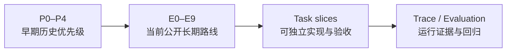

# Klaude-Code 文档中心

> [!abstract] 如何使用这个目录
> 这里的文档不是一组重复 README，而是按照 **路线 → 决策 → 规范 → 验收 → 实现 → 学习 → 交接** 分层组织。先看你要回答的问题，再进入对应层级。

## 当前项目位置

- 原始基础路线：Stage 0–34 已实现/持续加工，Stage 35–36 仍是基础路线计划。
- Enterprise Harness 路线：README 中的 E0–E9 是当前对外长期路线。
- P0 Trace：Task 1–3 已完成；模型/工具/权限 Trace 与 Evaluation 仍在后续加固和计划中。

> [!warning] 文档状态边界
> 代码和提交事实优先于历史文档中的旧状态。规范/ADR 说明“应该如何做”，Task 开发文档说明“已经做了什么”，学习文档说明“如何理解和表达”。

## 推荐阅读路径

### 我想快速理解项目

1. [项目 README](../README.md)
2. [工程文档索引](./engineering/README.md)
3. [P0–P4 历史总控](./engineering/roadmap/p0-p4-upgrade-master-plan.md)

### 我想理解 Trace 为什么这样设计

1. [ADR-001：本地结构化 Harness Trace](./engineering/adr/ADR-001-local-structured-harness-trace.md)
2. [Trace 事件契约](./engineering/specs/harness-trace-event-contract.md)
3. [Trace 存储与隐私规范](./engineering/specs/harness-trace-storage-and-privacy.md)
4. [Trace MVP 验收计划](./engineering/evaluation/trace-mvp-acceptance-plan.md)

### 我想知道 Task 1–3 实际改了什么

1. [Task 1：Trace 契约与安全基础](./engineering/dev-docs/task-1-trace-contract-foundation.md)
2. [Task 2：JSONL Trace 存储](./engineering/dev-docs/task-2-jsonl-trace-storage.md)
3. [Task 3：QueryEngine 生命周期 Trace](./engineering/dev-docs/task-3-query-lifecycle-trace.md)

### 我想学习或准备面试

1. [为什么先做 Trace 与 Evaluation](./learning/enterprise-upgrade/01-why-trace-and-evaluation-first.md)
2. [Trace 架构与实施推演](./learning/enterprise-upgrade/02-trace-architecture-and-implementation-plan.md)
3. 再回看对应的 ADR、规范和 Task 实现报告。

### 我是接班 Agent

1. 先读项目根目录 `CLAUDE.md`。
2. 再读 [工程文档索引](./engineering/README.md)。
3. 读取用户知识库中的接班文档：`8.Easy-Agent项目接班Agent工作交接文档.md`。
4. 未经用户明确启动，不要自动开始 Task 4。

## 文档分层

| 层级 | 目录/文件 | 回答的问题 |
|---|---|---|
| 对外定位 | `README.md`、`README.zh-CN.md` | 项目是什么、当前做到哪里、未来做什么 |
| 路线 | `engineering/roadmap/` | 为什么按这个优先级升级 |
| 架构决策 | `engineering/adr/` | 为什么选择这个方案，而不是替代方案 |
| 技术规范 | `engineering/specs/` | 事件、存储、隐私边界具体遵守什么契约 |
| 验收评估 | `engineering/evaluation/` | 什么条件下算完成、如何回归 |
| 实现报告 | `engineering/dev-docs/` | 每个 Task 改了什么、遇到什么困难、如何验证 |
| 学习材料 | `learning/` | 如何理解架构、如何进行面试推演 |
| 接班材料 | 外部知识库/未来 `handoff/` | 新 Agent 如何快速恢复上下文 |

## 路线版本关系

> [!note] P0–P4 与 E0–E9 的关系
> `P0–P4` 是早期升级优先级和设计历史；`E0–E9` 是当前 README 对外使用的长期 Enterprise Harness 路线。前者不删除，后者作为当前公开路线；二者不是两套互相冲突的项目。

## 文档状态标签

- ✅ **Implemented**：代码、文档和聚焦验证均有证据。
- 🔧 **Hardening**：基础能力存在，正在补生产级边界、恢复、观测或治理。
- 🚧 **In Progress**：当前已有明确实现 Slice。
- 📋 **Planned**：方向已确定，但尚未进入当前实现周期。
- 🔬 **Research Direction**：需要实验和证据，暂不承诺交付。

## 维护规则

1. 新的架构方向先更新路线或 ADR，再进入实现。
2. 新的字段、事件和隐私边界先更新 specs，再修改代码。
3. 每个完成的 Task 在 `engineering/dev-docs/` 记录实现、困难和验证。
4. 验收标准集中在 `engineering/evaluation/`，不要散落到多个 Task 文档。
5. 历史文档保留事实，但过时状态必须加说明或更新 frontmatter。
6. 移动文档使用 `git mv`，同步修复 Obsidian wikilink 和 Markdown 相对链接。
7. 项目工程文档只在隔离 worktree 中维护；不要触碰主仓库的学习笔记。
