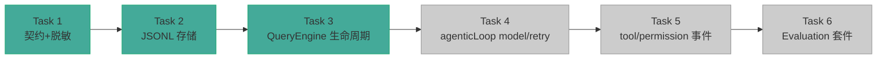

# Easy-Agent 开发文档索引

> [!abstract] 系列说明
> 企业级 Harness 升级（P0 Trace / Evaluation 路线）的逐阶段开发文档。
> 每份文档记录：**迭代内容 → 实现效果 → 涉及文件 → 真实困难与解决 → 面试设计决策**。

---

## 📚 文档导航

| 阶段 | 文档 | 核心内容 | 状态 |
|------|------|----------|------|
| Task 1 | [[dev-doc-task-1-trace-contract-foundation\|Trace 事件契约与安全基础]] | 事件 DTO、17 类型、脱敏引擎、安全摘要 | ✅ done |
| Task 2 | [[dev-doc-task-2-jsonl-trace-storage\|本地 JSONL Trace 存储]] | Writer/Reader、受控路径、失败隔离 | ✅ done |
| Task 3 | [[dev-doc-task-3-query-lifecycle-trace\|QueryEngine 生命周期 Trace]] | started/finished/failed/aborted 接入 | ✅ done |

## 🗺️ 路线总览

## 🎯 面试速查（三大高频拷打点）

> [!faq]- 为什么选 JSONL 而不是 SQLite / 大 JSON？
> 天然追加、部分可读、零依赖、可 grep/jq 分析——观测数据的事实标准。

> [!faq]- 如何保证 Trace 不泄漏敏感信息？
> 两层防御：`redaction.ts` 值级脱敏（Bearer/sk-/私钥/键值对）+ `queryLifecycle.ts` 字段级克制（白名单，压根不收集）。

> [!faq]- Trace 写入失败会影响 Agent 吗？
> 不会。Writer 内部 `catch(() => {})` 吞错，且 `createTraceWriter` 失败返回 noop——观测系统"可以丢，不能砸"。

---

## 🗂️ 参考规范文档

> [!note] 完整契约定义（另见工程目录）
> - `ADR-001-local-structured-harness-trace.md` — 架构决策记录
> - `harness-trace-event-contract.md` — 事件契约规范
> - `harness-trace-storage-and-privacy.md` — 存储与隐私规范
> - `trace-mvp-acceptance-plan.md` — 验收计划
