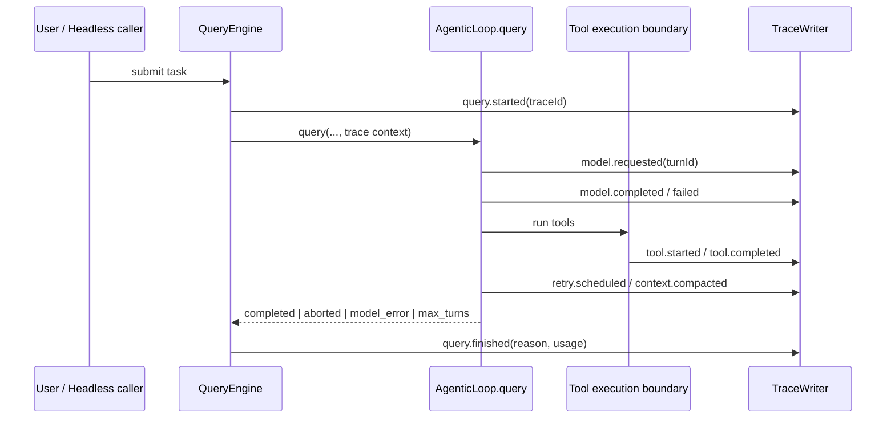

# ADR-001：采用本地结构化 Harness Trace 作为可观测性与评测地基

> [!success] 当前实现状态
> 本 ADR 的架构决策已接受并开始实施。Task 1（契约/脱敏）、Task 2（JSONL 存储）和 Task 3（QueryEngine 生命周期 Trace）已完成；模型/重试、工具/权限事件以及 F1–F7 Evaluation 仍是后续任务。

## Context

Easy-Agent 已具备多轮 Agent Loop、工具调用、权限、MCP、上下文压缩、会话、子 Agent 与 TUI 等能力。现有 `src/core/agenticLoop.ts` 已向 UI 暴露 `tool_use_start`、`tool_use_done`、`api_retry`、`turn_usage`、`turn_complete` 和 `error` 等瞬时事件；`src/session/storage.ts` 也会持久化 transcript、工具事件、usage 与 compaction 记录。

但现有数据并不是为“重建一次任务如何决策、如何失败、如何恢复”设计的统一事件契约：

- 一次用户任务缺少稳定的任务级关联 ID；
- 模型 turn、权限决策、工具执行、retry、compaction 与终止原因难以按因果关系查询；
- session transcript 以恢复对话为主要目标，不能替代面向诊断和评测的 trace；
- 新增 Memory、Multi-Agent 或 Provider 适配前，缺少证明改动有效、不会回归的证据链。

本 ADR 服务于 [[../roadmap/p0-p4-upgrade-master-plan|P0–P4 企业级 Harness 升级历史总控]] 的 P0 阶段。

## Decision

采用**本地、结构化、版本化、best-effort 的 JSONL Harness Trace**作为第一阶段可观测性能力。

### 1. Trace 的最小生命周期

- `QueryEngine` 是**顶层任务 trace 的生命周期所有者**：创建 `traceId`、附加 session/cwd/model 运行元数据、确保结束事件写出。
- `agenticLoop.query()` 是**模型 turn 和循环终止事件**的事实来源。
- `runTools()` / 单工具统一执行边界是**工具开始、工具完成、结果摘要与错误分类**的事实来源。
- 未来 `runChildAgent` / `runAsyncAgent` 创建 child trace；以 `parentTraceId` 和 `parentSpanId` 关联，不将子 Agent 伪装为主 Agent 的普通工具事件。
- `TraceWriter` 只负责序列化、脱敏、截断、缓冲与落盘；不得承担业务决策。

### 2. 存储格式

- 每个顶层任务一个 append-only `.jsonl` 文件；每行一个完整 JSON event。
- 每个 event 必须带 `schemaVersion`、`traceId`、`eventId`、`timestamp`、`eventType`。
- 事件顺序以**本 trace writer 的单调 `sequence`** 为准；墙钟时间仅用于诊断，不能作为严格排序唯一依据。
- 每条 JSONL 行必须独立可解析；尾部不完整行允许被 reader 忽略，以适应进程崩溃。

### 3. 默认数据最小化

- 永不记录 API key、Authorization header、Cookie、access token、密码或推断为敏感的环境变量值；
- 默认记录模型名、工具名、参数字段名、长度、hash/摘要、exit code、耗时、错误类别；
- prompt、模型原文、文件内容、Shell stdout/stderr、工具完整 input/output **默认不持久化**；
- 任何未来“记录原文”能力都必须是显式 opt-in、具备大小上限与红线字段脱敏。

详见 [[../specs/harness-trace-storage-and-privacy|Trace 存储与隐私规范]]。

### 4. 失败隔离

Trace 是诊断辅助系统，不是 Agent 主路径依赖：

- writer 初始化、序列化、目录创建、I/O、flush 失败均不得改变模型、工具、权限、session 的主行为；
- 失败仅以受限的本地 debug/diagnostic 信号报告；
- 禁止在 error handler 内递归写 trace；
- 有限缓冲、事件大小上限和超时/降级策略必须先于异步队列优化定义。

## Consequences

### 正面结果

1. 可以按一次任务还原：用户提交 → 模型 turn → 工具/权限/retry/压缩 → 终止原因。
2. Bad Case 可变成回归 fixture，而不只是一次聊天记录。
3. 后续 Context、Memory、Subagent、Provider 改造具有可量化的基线。
4. 面试中可以用真实工程因果链说明 Harness Engineering，而不是堆砌功能名词。

### 成本与风险

1. 本地 trace 仍可能承载路径、命令、项目结构等敏感元数据；必须落实脱敏和 retention。
2. 事件模型过宽会造成性能/I/O 负担与隐私膨胀；MVP 必须保持窄边界。
3. 事件模型一旦被测试/工具依赖，字段变更须遵循 schema version 策略。
4. Trace 只能说明运行发生过什么，不能独自判定模型推理“正确”；必须与 task evaluation 配套。

## Alternatives considered

### A. 继续依赖普通日志

拒绝。日志等级与文本不表达任务、turn、工具、子 Agent 之间的稳定关联；机器聚合与 regression 断言成本高。

### B. 扩展 session transcript

拒绝。`src/session/storage.ts` 的 transcript 首要职责是对话恢复，且其中可保存消息内容；将诊断/评测语义直接耦合会放大隐私与兼容性风险。

### C. 一开始接入 OpenTelemetry / 云端平台

拒绝。它引入服务端、账号、成本、数据治理与网络依赖，偏离本地 CLI 的 MVP；未来可通过 exporter adapter 演进。

### D. 每个工具自行写 trace

拒绝。横切逻辑会散落、遗漏 MCP/新工具、破坏统一字段和失败隔离。应在统一工具执行边界采集。

### E. 先做数据库或可视化 Dashboard

拒绝。JSONL 已满足本地 append、崩溃容忍、人工检查和 fixture 解析；先证明诊断价值，再投资查询/可视化。

## Implementation guardrails

- 仅在 `src/observability/` 新增独立模块，避免从业务工具反向依赖 UI；
- 接入点不得修改 prompt、权限结果、工具结果和模型请求语义；
- trace context 必须可选，旧调用方不传时行为不变；
- 先覆盖主 Agent；subagent/async-agent 关联作为第二小步；
- 每增加一个 event type，同时增加其“成功、异常或缺失字段”测试用例；
- 任何代码修改前，将依据当前可用的 GitNexus/直接调用链做影响记录。

## Interview defense

> [!question] 为什么先做 Trace，不先做 Multi-Agent 或长期记忆？
> 现有项目并不缺 Agent 名词模块，缺的是可证明性。没有任务级 trace 和 evaluation，就无法解释多 Agent 在哪一轮委派错误、记忆在何处引入噪声，也无法证明修复没有回归。因此先建立低侵入的证据层，再用真实失败数据决定能力投资。

> [!question] 为什么 JSONL 而不是数据库？
> MVP 的访问模式是顺序写、按单任务回放、fixture 解析；JSONL 对本地 CLI 零服务依赖、崩溃容忍、便于人工检查。数据库只在跨大量 trace 的索引查询已被证明必要时再引入。
