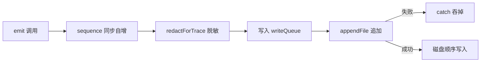

# Task 2：本地 JSONL Trace 存储

> [!abstract] 一句话总结
> 把 Task 1 定义的事件契约**落成真实的本地文件**——弹性 JSONL Writer/Reader，复用既有 session 持久化的受控路径，写入失败绝不影响 Agent 主路径。

| 元信息 | 值 |
|--------|-----|
| 阶段 | Task 2（承接 [[dev-doc-task-1-trace-contract-foundation\|Task 1]]） |
| 提交 | `6950503`（功能）→ `6932280`（merge 进 main） |
| 分支 | `feature/trace-task-2-storage` |

---

## 📦 交付物一览

> [!success] 三个交付物
> 1. **Trace Writer** — 事件逐行追加写入 `<项目目录>/traces/<traceId>.jsonl`
> 2. **Trace Reader** — 容忍坏行/截断行的 JSONL 读取器（Evaluation 回归用）
> 3. **受控存储路径** — 复用项目隔离机制，Trace 只落在本项目目录内

## 🗂️ 涉及文件

| 文件 | 动作 | 职责 |
|------|------|------|
| `src/observability/traceWriter.ts` | 新增 | JSONL 追加写、顺序队列、失败隔离 |
| `src/observability/traceReader.ts` | 新增 | 容错读取 |
| `src/session/storage.ts` | 修改 | `getTracePaths()` 受控路径 + traceId 消毒 |
| `src/observability/index.ts` | 修改 | 导出 Writer/Reader |
| `src/scripts/test-trace.ts` | 修改 | 存储层最小测试 |

---

## ⚖️ 为什么选 JSONL 而不是其他方案？

> [!tip] 方案对比
> | 方案 | 问题 |
> |------|------|
> | 单个大 JSON | 全量重写、追加困难、坏一处全废 |
> | SQLite | 引入依赖、IO 重、对追加型观测数据过重 |
> | **JSONL** ✅ | 每行独立事件，天然追加、天然部分可读、可被 `grep`/`jq` 直接分析 |

JSONL 是观测/日志领域事实标准（OpenTelemetry Collector 等），零依赖、流式友好。

---

## 🔧 Writer：顺序 + 隔离双保险



> [!info] 三个关键机制
> - **`sequence` 同步自增** — 即使异步写未完成，顺序已确定
> - **`writeQueue` Promise 链** — 多个 appendFile 串行，避免并发交错写坏文件
> - **失败吞掉** — 磁盘满/权限错不抛到主循环：观测系统"可以丢，不能砸"

## 📂 存储路径：复用一个已有机制

> [!example] 核心代码
> ```ts
> getTracePaths(cwd, traceId) {
>   const { projectDir } = await getSessionPaths(cwd, ...);
>   return { traceDir: projectDir + "/traces",
>            tracePath: ... + sanitize(traceId) + ".jsonl" };
> }
> ```

- **复用 `getProjectPathInfo` 项目隔离**：同仓库不同 cwd 的 trace 不串目录
- **traceId 消毒**：`../escape` 这类恶意 ID → 下划线替换，**防路径穿越逃出 traces/**（见困难 1）

## 📖 Reader 的容错哲学

> [!quote] 底线
> 一个 10MB trace 文件里有一行截断（进程崩溃），其余 9999 行仍然可读——**部分可读 > 全量不可读**。

```ts
// 缺文件 → []；坏行/截断行 → 跳过继续；逐行独立 try/catch
```

---

## 🧗 遇到的困难与解决（面试重点）

> [!danger] 困难 1：路径穿越高危漏洞
> 最初 `path.join(traceDir, \`${traceId}.jsonl\`)` 直接用原始 traceId——若为 `../escape`，会**逃出 traces/ 目录任意写**。
>
> **解决**：加 `sanitizeTraceId()`（非法字符→`_`，空→`trace`）+ 回归断言 `../escape` 的 dirname 与正常 trace 相同。
> **价值**：高危问题在合入前被独立审查拦截——这就是"提交前独立审查"的价值。

> [!bug] 困难 2：测试重复运行行数不对（5 ≠ 2）
> Writer 是追加型，测试临时目录复用项目哈希路径，上一次运行残留。
>
> **解决**：测试先 `fs.rm(tracePath, {force:true})` 清旧文件再写。

> [!bug] 困难 3：错误注入测试太弱
> 最初用"父目录不存在"模拟失败，但 `createTraceWriter` 可能已建好目录，测试形同虚设。
>
> **解决**：先建 writer → 拿路径 → **删整个 trace 目录** → 再 emit/close，断言不抛——真正验证失败隔离。

> [!bug] 困难 4：合并 main 时 stash 冲突（storage.ts）
> 主仓库 270+ 未提交改动，合并时 `storage.ts` 冲突（Task 2 Trace 函数 vs 用户中文注释）。
>
> **解决**：stash → 干净合并 → stash pop → 手动保留双方内容（Trace 函数 + 注释共存）。
> **教训**：合并前先确认目标文件是否有未提交改动。

---

## ✅ 验证

> [!success] 测试通过
> ```bash
> npx tsx src/scripts/test-trace.ts
> # → trace DTO/redaction/storage tests passed
> ```
> 覆盖：写读顺序、坏行容忍、persistence 关闭不写、目录删除不抛、路径穿越消毒。

---

## 🔗 与 Task 1 的分工

| 层 | Task 1 | Task 2 |
|----|--------|--------|
| 契约 | 事件结构、17 类型、sequence 语义 | — |
| 安全 | 值级脱敏、字段级克制 | 落盘前再过 `redactForTrace`（纵深） |
| 存储 | — | JSONL 写/读、受控路径、失败隔离 |

> [!quote] 面试口径
> Task 1 回答"**Trace 长什么样、什么能进**"，Task 2 回答"**Trace 落哪里、怎么落、坏了怎么办**"。

## 🔗 相关链接

- 上一阶段：[[dev-doc-task-1-trace-contract-foundation|Task 1：Trace 事件契约]]
- 下一阶段：[[dev-doc-task-3-query-lifecycle-trace|Task 3：QueryEngine 生命周期 Trace]]
