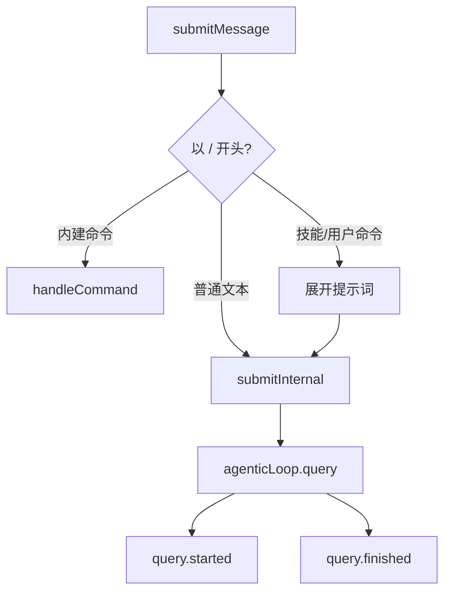

# Task 3：QueryEngine 顶层生命周期 Trace

> [!abstract] 一句话总结
> 把 Task 2 的 JSONL Trace Writer 接进 `QueryEngine`，让**每个顶层用户请求**自动产生一份结构化 Trace——记录 started / finished / failed / aborted 四个生命周期事件，全程不含敏感内容。

| 元信息 | 值 |
|--------|-----|
| 阶段 | Task 3（承接 [[dev-doc-task-2-jsonl-trace-storage\|Task 2]]） |
| 提交 | `1385998`（功能）→ `91595e1`（merge 进 main） |
| 分支 | `feature/trace-task-3-query-lifecycle` |

---

## 📦 本阶段做了什么

> [!success] 四个生命周期事件
> | 事件 | 时机 | 记录内容 |
> |------|------|----------|
> | `query.started` | agentic loop 启动前 | model、permissionMode、messageCount、promptLength、hasUserPrompt |
> | `query.finished` | loop 正常结束 | reason、messageCount、token 用量 |
> | `query.failed` | 抛出异常 | 错误类别、脱敏后的错误摘要 |
> | `query.aborted` | abort 信号触发 | reason: "abort_signal" |

**实现效果**：每次用户说话（或后台通知自动触发一轮）→ 生成一个 `<traceId>.jsonl`（位于项目 `traces/` 下），只记元信息，写入失败不影响主路径。

## 🗂️ 涉及文件

| 文件 | 动作 | 职责 |
|------|------|------|
| `src/core/queryEngine.ts` | 修改 | `submitInternal()` 接入 writer |
| `src/observability/queryLifecycle.ts` | 新增 | 4 个安全 payload 构造函数 |
| `src/observability/index.ts` | 修改 | 导出新 helper |
| `src/scripts/test-trace.ts` | 修改 | payload 断言 + 脱敏回归 |

---

## 🎯 为什么选 `submitInternal()`？

> [!info] 全路径汇聚点
> `submitMessage()` 会分流：斜杠命令走 `handleCommand()`，普通输入走 `submitInternal()`。而 `submitInternal()` 是**所有真正进入 agentic loop 的路径的汇聚点**：



- 天然覆盖所有"真模型轮次"
- **自动排除** `/help`、`/config` 等不需要模型参与的命令

## 🧩 为什么把 payload 抽到 `queryLifecycle.ts`？

> [!tip] 三个理由
> 1. **隐私边界集中管理** — 所有"哪些字段能进 Trace"的决策收在一个文件
> 2. **可测试** — 纯函数，不依赖 QueryEngine 实例
> 3. **两层防御** — `redaction.ts` 负责"值级"脱敏，`queryLifecycle` 负责"字段级"克制

## 🔢 traceId 粒度：每轮一个，而非每会话一个

> [!example] 设计决策
> - 每个顶层请求一个 `traceId`（`randomUUID()`）→ 一个 `.jsonl` 文件
> - 一个 trace = 一个可独立复现的单元，Evaluation 可直接对齐"输入特征 → 输出质量"
> - 后续 Task 4/5 可挂在同一 traceId 下形成完整因果链

## 🛡️ 错误处理：catch 不吞，finally 必 close

> [!warning] 关键模式
> ```ts
> } catch (error) {
>   traceWriter.emit(abortController.signal.aborted ? "query.aborted" : "query.failed", ...);
>   throw error;   // 原样抛出，不改变 Agent 语义
> } finally {
>   await traceWriter.close();   // 确保文件写完整
> }
> ```
> - `query.aborted` 用 `abortController.signal.aborted` 区分"用户取消" vs "真异常"

---

## 🧗 遇到的困难与解决（面试重点）

> [!danger] 困难 1：worktree 无独立 node_modules，tsc 编译到主仓库源码
> **现象**：build 报一堆"没编辑过的文件"（`executor.ts`、`globTool.ts`…）的 `TS1127 Invalid character`。
>
> **排查**：worktree `git status` 只有我改的 4 个文件（源码干净）→ 主仓库这些文件是中文注释（含全角破折号、`??`）→ worktree 无 `node_modules`，`tsc` 沿目录树向上找到主仓库依赖，编译的是**主仓库源码**。
>
> **解决**：worktree 内 `npm install --prefix . --ignore-scripts` 装独立 node_modules（197 包）。
>
> > [!quote] 面试价值
> > git worktree 经典坑——**worktree 共享 .git 对象库，但不共享 node_modules**。依赖解析会"向上查找"的工具（tsc/tsx）在 worktree 里都会撞见主仓库文件。

> [!bug] 困难 2：主仓库未提交改动挡住合并
> `git merge` 报 `Please commit your changes or stash them`，主仓库 278 个未提交改动（用户学习注释），`queryEngine.ts` 正是合并目标。
>
> **解决**：stash → 干净合并 → stash pop（**零冲突**，因注释改动与 Task 3 改动区域不重叠）。

> [!bug] 困难 3：GitHub 网络不通，push 失败
> 反复 `Failed to connect to github.com port 443`（VPN 未全局接管）。
>
> **解决**：切换 VPN 为 TUN 全局模式后恢复。本地提交不受影响。

---

## ✅ 验证

> [!success] 测试通过
> ```bash
> npx tsx src/scripts/test-trace.ts   # → trace DTO/redaction/storage tests passed
> npm run build                        # → tsc 0 错误
> ```
> 覆盖：started/finished 精确字段、failed 脱敏回归、aborted 结构。

## 🚫 隐私边界（本阶段红线）

> [!danger] 本阶段红线
> | 允许 | 绝不 |
> |------|------|
> | model 名、权限模式、消息数、prompt 长度、token 用量、结束原因、错误类别 | 用户 prompt 原文、系统 prompt、消息内容、工具输入/输出、stdout/stderr、API key |

payload 里所有字段名都是显式白名单，任何新增字段必须先过 `queryLifecycle.ts` 这关。

---

## 🔗 相关链接

- 上一阶段：[[dev-doc-task-2-jsonl-trace-storage|Task 2：本地 JSONL Trace 存储]]
- 完整契约定义：
  - `ADR-001-local-structured-harness-trace.md`
  - `harness-trace-event-contract.md`
  - `harness-trace-storage-and-privacy.md`

## 🚀 后续展望

> [!todo] 未完成规划
> - Task 4：`agenticLoop` 层 model.requested/completed/failed（重试、流重启）
> - Task 5：tool 与 permission 层事件（复用同一 traceId → span）
> - Task 6：F1–F7 确定性 Evaluation 套件，用 trace 做回归基线
