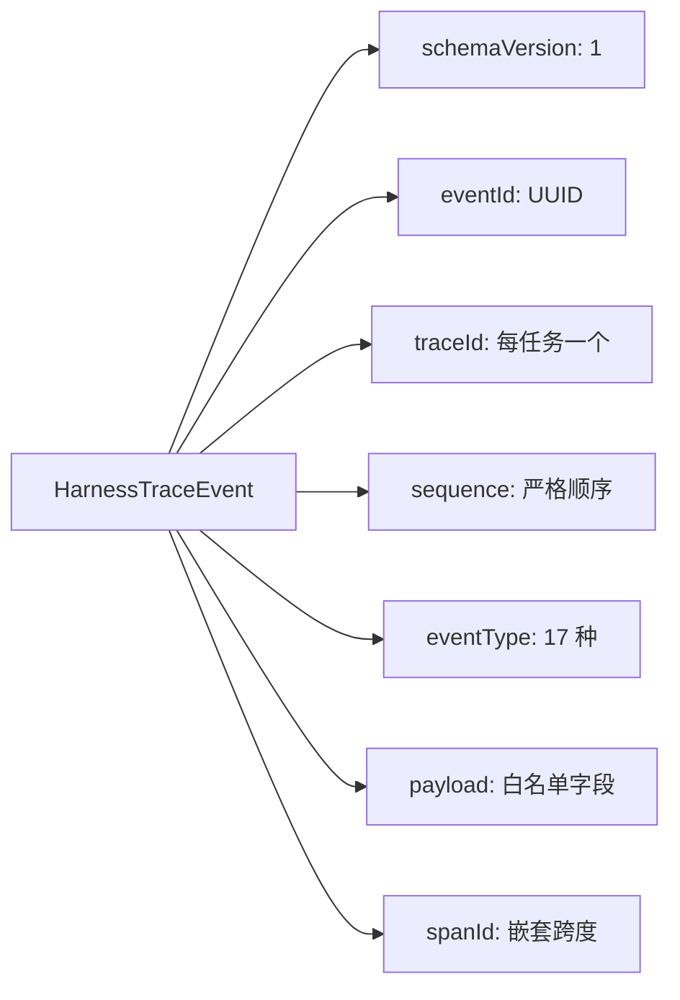
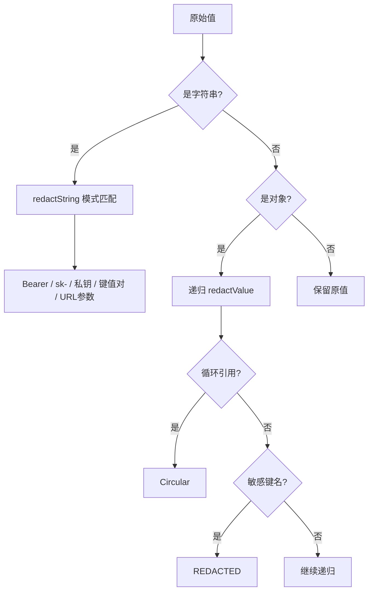

# Task 1：Trace 事件契约与安全基础

> [!abstract] 一句话总结
> 为 Easy-Agent 建立「结构化 Trace」的**数据契约**与**安全地基**：统一事件模型 + 脱敏引擎 + 安全摘要，让后续所有观测/评估工作都站在安全边界内。

| 元信息 | 值 |
|--------|-----|
| 阶段 | Task 1（P0 起点） |
| 提交 | `c0011b4`（契约）+ `ca009ce`（脱敏加固） |
| 分支 | `feature/trace-task-3-query-lifecycle` worktree（Task 1 的实现最初起于早期 `enterprise-harness-upgrade` 设计分支） |

---

## 📦 交付物一览

> [!success] 三个交付物
> 1. **事件契约** — 定义"一条 Trace 事件"长什么样
> 2. **脱敏引擎** — 密钥/token 进入 Trace 前被抹掉
> 3. **安全摘要** — 工具调用只记元信息，绝不落原文

## 🗂️ 涉及文件

| 文件 | 动作 | 职责 |
|------|------|------|
| `src/observability/types.ts` | 新增 | Trace 事件 DTO、17 种事件类型、`TraceSink` 接口 |
| `src/observability/redaction.ts` | 新增 | 脱敏引擎（值级） |
| `src/observability/index.ts` | 新增 | observability 统一出口 |
| `src/scripts/test-trace.ts` | 新增 | 最小脱敏/摘要测试 |

---

## 🧬 事件契约：一个事件 = 一行 JSON

> [!info] 设计核心
> **`sequence` 是顺序唯一来源**，`timestamp` 只是辅助——同毫秒多条事件时，时间戳无法排序。



> [!tip] 17 种事件类型是"未来规划"
> Task 1 只实现其中一部分，但类型先在契约里定义好——后续 Task 2–5 不用改契约。

## 🛡️ 脱敏引擎：三层防御

> [!warning] 红线
> **任何进入 Trace 的字符串 / 对象，其中的密钥、口令、token 必须被抹掉。**



## 📉 安全摘要：为什么只记元信息？

> [!example] summarizeToolInput 输出示例
> ```ts
> {
>   fieldNames: ["command", "path"],   // 字段名（最多 20 个）
>   serializedLength: 1024,             // 序列化长度
>   contentOmitted: true,               // 显式声明：内容已省略
>   redactedFieldNames?: ["apiKey"]     // 哪些字段因敏感被剔除
> }
> ```
> **绝不记录** `command` 的值、文件内容、stdout/stderr。

> [!quote] 面试口径
> 这是**最小化收集（data minimization）**原则：Evaluation 能统计"工具调用类型与规模"，但拿不到任何可泄漏的内容。

---

## 🧗 遇到的困难与解决

> [!bug] 困难 1：子代理两次超时卡住
> 同一修复任务两次超时（0 token 进展）。
>
> **解决**：改为会话内小步推进——只改 `src/observability` 与 `src/scripts/test-trace.ts`，每步验证后提交。后续任务不再依赖大粒度子代理编排。

> [!bug] 困难 2：转义 JSON 脱敏漏网
> 字符串内嵌 JSON（如 `'{\"apiKey\":\"abc123\"}'`）含转义引号，最初的正则漏过。
>
> **解决**：正则支持 `\\\"` 转义引号形式，覆盖"字面 JSON"与"转义 JSON"两种形态，加入回归用例。

> [!bug] 困难 3：循环引用 / bigint 导致 stringify 崩溃
> `JSON.stringify(circular)` 抛 `TypeError`；`bigint` 抛序列化错误。
>
> **解决**：`WeakSet` 追踪已访问对象 → `[Circular]`；`bigint` → 字符串化。两条都在测试里覆盖。

---

## ✅ 验证

> [!success] 测试通过
> ```bash
> npx tsx src/scripts/test-trace.ts
> # → trace DTO/redaction/storage tests passed
> ```
> 覆盖：嵌套密钥、Bearer、`sk-*`、`password=`、Authorization 各形态、私钥块、循环对象/数组、`bigint`、摘要不落原文。

## 🧭 为什么从"契约 + 脱敏"开始？

> [!faq]- 展开：路线依据
> 1. **契约先行**：事件格式统一，避免各任务各写各的再返工
> 2. **安全先行**：落盘之前先保证"能落盘的只有安全内容"——先写 Writer 再补脱敏容易漏
> 3. **可测先行**：脱敏是纯函数，最容易被单测锁定
>
> 企业级 Harness 工程顺序：**先定边界，再填功能**。

---

## 🔗 相关链接

- 下一阶段：[[task-2-jsonl-trace-storage|Task 2：本地 JSONL Trace 存储]]
- 再下一阶段：[[task-3-query-lifecycle-trace|Task 3：QueryEngine 生命周期 Trace]]
