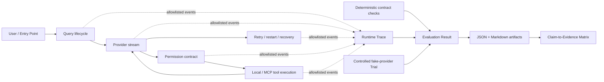

# Klaude-Code Resume Release R1 证据报告

## 1. 发布结论

R1 的目标不是宣布 Klaude-Code 已成为完整企业产品，而是证明 Enterprise Harness 的第一条纵向链路已经闭合：关键执行边界可观测、失败与恢复有界、显式拒绝不可升级、外部执行有安全预算，并能由一个确定性命令产出可审阅证据。

合并 PR-09 后，R1 可标记为 **evidenced**。依据是最终 [Invariant-to-Evidence Matrix](./r1-invariant-to-evidence-matrix.md)、`npm run verify:core` 结果和独立 Evaluation Artifact，而不是测试数量、覆盖率或主观演示。

## 2. R1 架构与证据流

Runtime Trace 只记录结构与安全摘要；Evaluation 消费确定性断言，不把 Trace 扩张为 prompt、模型正文、命令、文件内容或 Tool 输出仓库。

## 3. 受控端到端 Trial

`src/scripts/verify-r1-release.ts` 使用 Fake Provider 和只读 Probe Tool，但走真实的 `query()`、Permission 和 `runTools()` 路径：

1. 第一次模型响应发出一个 `tool_use`；
2. Permission 解析后，Probe Tool 实际执行一次；
3. 配对的 `tool_result` 回送第二次模型请求；
4. 第二次响应以 `end_turn` 完成；
5. 检查 Model、Permission、Tool Trace 顺序和 span 配对；
6. 检查 Tool 输入与结果 marker 不进入 Trace；
7. 生成 29 条断言的 JSON/Markdown Artifact。

这是单次、确定性、无网络的 Trial。它证明 Harness 编排闭环，不评估真实模型的 Coding 能力。

## 4. 真实 Bad Case 闭环

**Bad Case：** PR-08 安全测试构造了工作区内 symlink/junction 指向允许根之外的路径，原先仅使用 `path.resolve` / `path.relative` 的词法 containment 会错误放行。

**Root Cause：** 授权判断校验的是路径字符串，不是文件系统解析后的真实对象；链接目标改变了实际访问边界。

**Fix：** 已存在目标使用 `realpathSync.native`；新文件逐级查找最近存在祖先，对祖先做真实路径解析后再拼回缺失段，最终按 canonical path 判断 containment。

**Regression：** `npm run test:external-safety` 固化链接逃逸被拒绝，同时保留 cwd、新文件、Easy Agent Home 和 additional roots 的正常路径。详细实现事实见 [`PR-08 Dev Doc`](../learning/E3/pr-08-sandbox-mcp-secret-safety-dev-doc.md)。

## 5. 可以陈述的项目事实

- 在继承的本地 Coding Agent 基础上，设计并实现了 Query/Model/Retry/Stream/Tool/Permission 的隐私最小化 Trace 因果链与弹性本地存储。
- 建立了显式 deny 不可升级、ask 按入口消解、非法输入零副作用、同一 `tool_use_id` 单 Query 最多执行一次的统一 Tool/Permission 安全契约。
- 对 Provider Retry、Abort、Timeout、Partial Output、Reactive Compaction、文件真实路径、进程回收和 MCP 请求预算建立确定性回归门禁。
- 建立独立 Evaluation Artifact Store、25 项 Claim-to-Evidence Matrix 和受控端到端 Trial，以单命令生成机器可读与 Markdown 证据。
- 通过真实 symlink/junction 逃逸 Bad Case 完成 RED→根因→canonical containment 修复→回归闭环。

以上事实应明确属于 **Klaude-Code Enterprise Harness Track**；终端 CLI、会话、MCP、Skills、Sub-Agent、Teams、Hooks、多 Provider 等基础能力主要来自 Original Foundation Track，不能表述为当前维护者从零实现。

## 6. 现实限制

- R1 没有真实模型、真实网络或多仓库 Benchmark，不提供成功率结论。
- Sandbox 目前不是跨平台等价实现；非支持平台显式降级，R1 只承诺其不可升级 Permission。
- Canonical containment 缩小链接逃逸面，但校验与打开之间仍可能存在 TOCTOU。
- MCP 成功正文会按业务需要返回模型并受大小预算约束；通用 Secret Safety 承诺针对 Trace、Log、Error 和 Diagnostic，不是业务正文扫描器。
- package 名称 `easy-agent`、CLI 命令 `agent` 与数据迁移仍留给 E9；R1 不是正式发包或公开贡献发布。
- R1 证明的是当前提交的确定性不变量；后续 R2/R3 修改仍须持续扩充和重跑证据。
