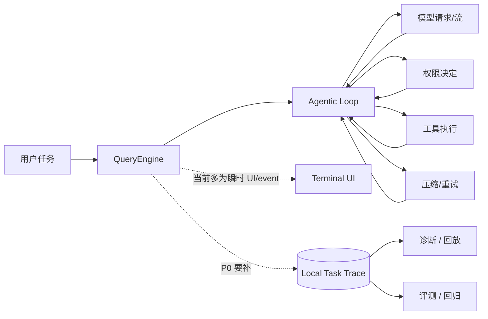

# 从功能集合到企业级 Agent Harness：为什么第一步是 Trace 与 Evaluation

> [!note] 当前位置
> 本文是学习与面试材料，不是运行时规范。项目当前对外长期路线以根目录 README 的 E0–E9 为准；早期 P0–P4 设计见 [[../../engineering/roadmap/p0-p4-upgrade-master-plan|P0–P4 历史总控]]。


> [!important] 这一阶段你要建立的能力
> 不是“给项目加一个日志功能”，而是学会判断：当一个 Agent 项目已经有 Loop、Tools、MCP、Memory、Subagent、Sandbox 后，为什么仍然可能不具备企业级工程能力。

关联：[[../../engineering/roadmap/p0-p4-upgrade-master-plan|P0–P4 历史总控]]

## 1. 项目真正的目标是什么？

目标不是复制 Claude Code 的命令名，也不是堆出看起来先进的功能。目标是：

```text
在明确的真实 coding task 中，Easy-Agent 能够
完成任务 → 失败时可解释 → 修复后可回归验证 → 安全边界不被破坏。
```

如果一个 Agent 偶尔完成任务，我们只能说它“能跑”；如果它能稳定完成、失败可定位、改动可验证，才开始接近“可用的 Harness”。

> [!warning] 面试陷阱
> “我们实现了 Multi-Agent、Memory、MCP、Sandbox，所以是企业级项目。”
>
> 这句话站不住。面试官会继续问：**哪个能力提升了什么指标？失败时如何定位？怎么防止改动让成功率倒退？**

## 2. 从 JD 反推：面试官到底在判断什么？

DeepSeek Agent Harness JD 的关键词包括上下文、长期记忆、Subagent/Multi-Agent、长程任务、模型与 Harness 适配、Benchmark、真实任务反馈、Agent Loop、Tool Use、Planning、Skills、MCP。

表面上是一串名词；工程上可收敛为四个问题：

| 面试官真正的问题 | 项目必须拿出的证据 |
| --- | --- |
| Agent 如何执行？ | 清晰的 runtime state machine、模块边界和失败处理。 |
| Agent 为什么成功或失败？ | 任务级 trace，能串起模型、工具、权限、上下文和重试。 |
| 你怎么知道改动更好了？ | 可重复的 task suite、指标、基线与回归结果。 |
| Agent 会不会造成不可接受的后果？ | 权限决策、安全策略、沙箱与拒绝路径的验证。 |

## 3. 当前 Easy-Agent 的位置

Easy-Agent 已经超出 toy：

- `src/core/agenticLoop.ts` 有多轮模型调用、工具调用批次、并发控制、取消、token 警告、重试事件；
- 工具、MCP、权限模式、Sandbox、会话、上下文压缩、Subagent/Team 体系均存在；
- Ink UI 接收 runtime event 并展示交互状态。

但这里有一个关键断层：这些模块产生了大量事件，却没有形成一条**可持久化、可关联、可审计的任务叙事**。



## 4. 为什么 P0 是 Trace，而不是先加更多功能？

### 4.1 因果链

假设你优先增加“更智能的多 Agent 自动协作”。当用户说“它有时会把测试命令跑错”，你至少需要知道：

1. 用户最初的任务是什么？
2. 主 Agent 是哪一轮决定委派的？
3. 子 Agent 看到了哪一段上下文？
4. 模型实际发出了什么 tool call？
5. 权限系统是否改变了行为？
6. Shell 的真实 exit code、stdout/stderr 和耗时是什么？
7. 出错后 Agent 为什么没有恢复？
8. 本次修复是否让其他任务退化？

没有 trace，上述问题只能靠猜；没有 evaluation，修复只能凭感觉。

因此：

```text
Trace 解决“发生了什么、为什么”。
Evaluation 解决“修复真的更好吗、会不会回归”。
```

### 4.2 被拒绝的替代方案

| 替代方案 | 为什么现在不选 |
| --- | --- |
| 先重写 Agent Loop | 风险极高；没有评测基线，无法证明重写后的行为更好。 |
| 先引入向量数据库做长期记忆 | 可能掩盖上下文丢失问题；先测量“何时、丢了什么”。 |
| 先做复杂 Multi-Agent orchestration | 放大调用链和失败面；没有 parent-child trace 时更难调试。 |
| 先接云端 observability 平台 | 引入隐私、成本、账号和部署依赖；本地 CLI MVP 不需要。 |
| 只加普通文本日志 | 难以按一次任务关联，也难供程序解析和自动评测使用。 |

## 5. P0 的最小设计：Local Structured Trace

### 5.1 核心数据模型

```text
一次用户提交                  traceId
├─ 第 1 个模型 turn            turnId=1
│  ├─ 模型请求
│  ├─ 流完成
│  ├─ 工具 bash 开始/结束
│  └─ 工具 Read 开始/结束
├─ 第 2 个模型 turn            turnId=2
│  ├─ 权限请求 → 用户允许
│  └─ 工具 Edit 开始/结束
└─ 任务终止                    completed / aborted / model_error / max_turns
```

每条事件都至少包含：

```ts
{
  schemaVersion: 1,
  traceId: "...",
  timestamp: "...",
  eventType: "tool.completed",
  turnId: 2,
  // 只加入这个事件确实需要的数据
}
```

这使得 trace 既能被人阅读，也能被程序聚合。

### 5.2 事件不是日志等级

`info/warn/error` 说明严重程度，却无法表达 Agent 的因果关系。Harness 更需要的是领域事件：

```text
query.started
model.requested
model.completed
permission.resolved
tool.started
tool.completed
context.compacted
retry.scheduled
query.finished
```

### 5.3 关键非功能要求

1. **不影响主路径**：trace 写入失败，只产生本地诊断，不得让用户任务失败。
2. **默认隐私保护**：不写 API key；prompt、工具参数、工具结果须做截断和敏感字段处理。
3. **可演进**：带 `schemaVersion`；未来增加字段不破坏旧 trace。
4. **低成本**：MVP 使用本地 JSONL 追加写，不上数据库。
5. **关联关系**：未来必须能表达主 Agent → 子 Agent → 异步 Agent 的 parent-child 关系。

## 6. 实施时你要观察的真实难点

> [!tip]
> 不要把“设计难点”理解成“代码难写”。Harness 的难点通常是边界选择。

### 难点 A：在哪一层采集？

- 在 UI 采集：只能看到 UI 消费过的事件，无法保证完整；不合适。
- 在每一个工具内部采集：工具可能遗漏，且会把 observability 横切逻辑散落到全仓库；不合适。
- 在 `AgenticLoop` 采集：最接近模型与工具循环，能覆盖主体，但还要补 QueryEngine 的 session/用户输入语义；适合作为主入口之一。
- 在 `QueryEngine` 采集：最接近顶层用户任务和 session；适合作为 trace 生命周期所有者。

**预期设计判断**：`QueryEngine` 创建/结束 trace，`AgenticLoop` 与统一工具执行边界发出事件，独立 writer 负责落盘。

### 难点 B：Trace 能记录多少内容？

记录所有 prompt、全部文件内容和 Shell 输出最容易调试，但会泄露密钥、代码和个人数据，也会导致文件膨胀。

**预期设计判断**：先记录结构、元数据、摘要、长度、哈希或截断内容；对敏感字段执行显式 redaction。是否保存原文必须是显式、可配置且受限的能力。

### 难点 C：如何避免 Trace 反过来拖慢 Agent？

同步磁盘写入可能影响流式 UI；持久化失败也不应该中断任务。

**预期设计判断**：writer best-effort、事件缓冲受限、失败降级、结束时 flush；先用简单实现测量，再决定是否需要异步队列。

## 7. 验收不是“能生成一个 JSON 文件”

最低验收应覆盖：

| Case | 必须证明的事实 |
| --- | --- |
| 正常文本/工具任务 | trace 能按 `traceId` 关联模型轮次、工具顺序和最终完成。 |
| 权限拒绝 | 能看到请求、决策、被拒工具和 Agent 后续行为。 |
| API retry / model error | 能看到失败分类、重试次数和终止原因。 |
| 用户取消 | trace 有 `aborted` 结论，且不写出伪“completed”。 |
| trace 磁盘失败 | Agent 原行为继续，trace 子系统产生可见的降级信号。 |

## 8. 面试防御：从项目细节回答，而不是背定义

### Q1：为什么你没有一开始做长期记忆或 Multi-Agent？

**回答骨架：**

> 我先对现有系统做了能力盘点，发现 Loop、工具、权限、MCP、上下文和子 Agent 已经存在，瓶颈不是“缺少概念模块”，而是失败不可归因、修改不可量化。比如多 Agent 任务失败时，我无法稳定关联主 Agent 的委派、子 Agent 上下文、工具执行和重试。因此我先实现本地结构化 Trace，并把真实任务固化为评测集。它让后续记忆和协作优化能以失败样本和回归指标驱动，而不是靠主观感觉堆功能。

**追问：你怎么证明 Trace 不是过度设计？**

> 我限定了 MVP：只在本地写 JSONL，只覆盖顶层任务、模型 turn、工具、权限、重试、压缩和终止，不做云端平台。它直接服务本地诊断和 regression fixture；如果无法用它定位至少一个真实 Bad Case 或驱动一条回归测试，就不扩大范围。

### Q2：为什么不直接使用普通日志？

**回答骨架：**

> 普通日志强调文本和级别，适合单点排障；Agent 失败是跨模型、工具、权限、上下文的因果链问题。我需要稳定的 `traceId` / `turnId`、事件类型和字段契约，才能把一项用户任务重建为时间序列，并让评测程序计算成功率、工具失败率和人工接管率。日志可以是 Trace 的输出形式，但不能替代事件模型。

### Q3：Trace 如何处理隐私和安全？

**回答骨架：**

> 默认最小化记录：永远不记录 API key；内容字段有长度上限和 redaction 策略；完整 prompt 或工具输出不是默认行为，需要用户显式配置。Trace 写入失败不能影响 Agent 主流程。这个设计用可诊断性换取的隐私成本必须可控，不能因为方便调试而默认落全量敏感数据。

## 9. 你必须能回答的迁移问题

1. 如果 trace writer 位于每个工具内，未来新增 MCP tool 时最容易发生哪类可观测性缺口？为什么统一工具执行边界更合理？
2. `tool.completed` 应该记录完整 stdout/stderr、摘要，还是 hash？请按“本地个人使用”和“团队共享 trace”两种场景给出不同策略。
3. 一个 trace 显示模型重复调用同一失败命令 5 次。你会把问题优先归类为模型、prompt、tool result 语义、permission、还是 recovery policy？你还需要什么证据？
