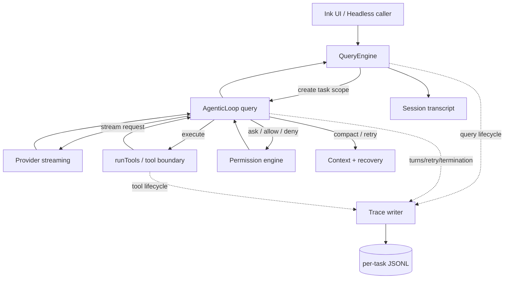

# P0 Trace：架构与实施计划（学习 / 面试推演版）

> [!abstract]
> 这不是“教你加日志”的笔记。它训练你把一个 Agent Harness 的真实工程问题，讲成**现象 → 边界 → 取舍 → 失败模式 → 验证证据**的链路。

前置阅读：[[01-why-trace-and-evaluation-first|为什么先做 Trace 与 Evaluation]]。设计事实：[[../../engineering/adr/ADR-001-local-structured-harness-trace|ADR-001]]、[[../../engineering/specs/harness-trace-event-contract|事件契约]]、[[../../engineering/specs/harness-trace-storage-and-privacy|隐私规范]]、[[../../engineering/evaluation/trace-mvp-acceptance-plan|验收计划]]。

## 1. 先建立你的架构心智模型

Easy-Agent 现有运行时并不是“调用一次模型 API”：



### 你必须先区分的三种东西

| 概念 | 谁消费 | 核心用途 | 为什么不能互相替代 |
| --- | --- | --- | --- |
| UI event | Ink UI | 实时渲染、权限交互、状态反馈 | 可以是瞬时的；不保证可持久化或完整。 |
| Session transcript | resume / conversation | 恢复对话与历史 | 关注 message 与 session，不天然表达一次任务的因果图。 |
| Harness trace | 开发者、评测、Bad Case 分析 | 重建任务生命周期与失败证据 | 需要 `traceId`、事件契约、顺序、隐私与降级规则。 |

> [!question]
> 如果你把 trace 写在 UI 层，用户通过 headless mode 执行任务时会丢掉哪些证据？

## 2. 最重要的设计判断：Trace 由谁拥有？

### 方案判断

```text
QueryEngine：拥有“一个顶层任务从开始到结束”的语义。
AgenticLoop：拥有“模型多轮循环、重试、终止”的事实。
统一工具执行边界：拥有“工具实际开始/结束、结果分类”的事实。
TraceWriter：拥有“脱敏、序列化、落盘和失败隔离”的职责。
```

这是一种**生命周期所有权与事实所有权分离**：

- QueryEngine 不应重新判断工具是否成功；
- Tool 不应知道 trace 文件在哪；
- Writer 不应改变权限或模型行为；
- AgenticLoop 不应承担文件系统存储策略。

### 为什么不是“每个工具各自写一行日志”？

新工具、MCP 工具、失败路径和并发路径都可能遗漏；字段会随作者习惯漂移；每个工具都要处理脱敏和 I/O 错误。最终你得到的是一堆文本，而不是可评测事件协议。

## 3. P0 数据流：一次任务会发生什么

```text
用户提交任务
  → QueryEngine 创建 traceId
  → writer(query.started)
  → AgenticLoop 请求模型（turn=1）
  → writer(model.requested)
  → 模型要求调用 Tool
  → writer(model.completed)
  → tool boundary 写 tool.started
  → Permission allow/deny → writer(permission.resolved)
  → ToolResult 返回 → writer(tool.completed)
  → AgenticLoop 请求模型（turn=2）
  → ...
  → QueryEngine 在 finally/return 路径写 query.finished
```

注意两个工程事实：

1. **流式文本不是 trace 的主体。**P0 记录模型 turn 的结构和终结，不默认记录模型原文。
2. **一个 session 可以有多次任务。**每次顶层 submit 都要有新 `traceId`；不能误用 `sessionId`。

## 4. 实施拆分：先小后大

> [!todo] 当前状态
> 以下是实施计划，不是已完成代码。只有本文档与设计文档已经创建。

### Slice 1：纯模块，不接 Runtime

新增独立 `src/observability/`：

```text
types.ts       # v1 event DTO 与 invariant
redaction.ts   # allowlist summary、敏感字段处理、size guard
traceWriter.ts # JSONL best-effort writer
traceReader.ts # fixture / diagnostics 的容错 reader
```

先验证 event 生成、redaction、JSONL 坏尾行处理和 writer 失败降级，**不修改 Loop**。

### Slice 2：顶层生命周期

只在 QueryEngine 的提交边界接入：

```text
create trace → run existing loop → finish trace in all terminal paths
```

验证 completed、aborted、unhandled failure 的终止语义。此时即使尚未写 tool event，也已经有一条可关联任务骨架。

### Slice 3：Agent Loop 事件

从 `agenticLoop.query()` 发出模型 request/completed/failed/retry、token warning、compaction 和 termination 事实。保持现有 `AgenticLoopEvent` 对 UI 的兼容；Trace 不是替换 UI event。

### Slice 4：统一工具执行边界

只在 `runTools()` / 单工具执行协作点产生 `tool.started` / `tool.completed` / `tool.failed`，并从 permission 回调/决策边界写 permission event。

### Slice 5：评测与最小诊断入口

建立 deterministic fixtures 与 reader；确认 trace 能被开发者按时间线检查。暂不做 dashboard、云端导出或自动质量裁判。

## 5. Bad Case 思维：Trace 必须回答什么

| 失败现象 | 没有 Trace 时的猜测 | Trace 应给出的证据 |
| --- | --- | --- |
| Agent 重复跑失败命令 | “模型笨” | tool input summary、outcome、turn 顺序、模型是否收到失败摘要、retry/permission 事件。 |
| 用户说工具没执行 | “UI 显示有问题” | `tool.started` 是否存在；是否 permission deny；是否 abort；是否 executor fail。 |
| 同一任务偶尔失败 | “网络不稳定” | model.failed 分类、retry attempt、duration、终止 reason、上下文/压缩发生时机。 |
| 长任务突然遗忘前文 | “模型上下文不够” | compaction 触发点、turn 数、token warning、压缩前后指标；不能仅凭主观印象。 |

> [!warning]
> Trace 不是万能解释器。它只能提供因果证据链；“模型为何选择某种策略”仍可能需要 prompt、tool result 语义和任务评测的联合分析。

## 6. 面试追问树（先自己答，不看模板）

> [!question] Q1：为什么普通结构化日志不足以满足 Agent Trace？
>
> 你的回答必须出现：任务关联、turn/tool 因果、稳定契约、机器评测、普通日志的局限。若只说“Trace 更详细”，回答不合格。

> [!question] Q2：为什么 `QueryEngine` 创建 trace，而不是 `agenticLoop.query()`？
>
> 你的回答必须出现：顶层用户任务边界、session 与 task 的区别、UI/headless 一致性、loop 只拥有循环事实。

> [!question] Q3：如何确保 Trace 不泄露用户代码与密钥？
>
> 你的回答必须出现：默认不采集、allowlist DTO、最后一道 redaction、对抗测试、retention、不能仅依赖正则。

> [!question] Q4：Trace writer 写磁盘失败时怎么办？
>
> 你的回答必须出现：best-effort、主路径不受影响、避免 error recursion、degraded 信号、有限缓冲，而不是“try/catch 一下”。

> [!question] Q5：为什么 JSONL 是合理 MVP，而不是数据库、Kafka 或 OpenTelemetry？
>
> 你的回答必须出现：本地 CLI、append-only、单任务回放、零服务依赖、崩溃尾行容忍、何时应升级。

> [!question] Q6：如果面试官说“你只是在写日志，和 Harness 无关”，你如何反驳？
>
> 不要重复功能列表。请把 Trace 与 Agent Loop、Tool Use、Permission、Context、Bad Case、Evaluation 的因果闭环讲出来。

## 7. 自我评分卡

每题按下面标准打分：

| 分数 | 你的回答状态 |
| --- | --- |
| 0 | 只能复述“加 Trace 便于调试”。 |
| 1 | 能说出事件与 JSONL，但没有边界和失败策略。 |
| 2 | 能解释 ownership 与隐私，却没有验证方案。 |
| 3 | 能讲清取舍、failure isolation、fixture 和未来演进。 |
| 4 | 能针对追问给出反例、非目标、证据与决策条件。 |

> [!tip]
> 当你能用一次“权限拒绝后模型改道”的 trace 时间线，解释事件如何帮助定位问题、怎样固化为 regression fixture，才说明你掌握了 Harness 工程思维。

## 8. 进入代码前的准入门槛

- [ ] 能区分 UI event、session transcript、trace。
- [ ] 能解释为什么 `traceId ≠ sessionId`。
- [ ] 能画出 QueryEngine → AgenticLoop → Tool 边界的数据流。
- [ ] 能说出 P0 明确不做的五件事。
- [ ] 能为 writer failure 设计不影响 Agent 主路径的测试。
- [ ] 已阅读 [[../../engineering/evaluation/trace-mvp-acceptance-plan|验收计划]]，并能解释 F1–F7 各自防什么回归。

---

## 下一次学习 / 面试演练入口

若你要进入真正的单题高压面试，而不是阅读答案，请调用：

```text
/interview-coach start trace-observability
```

第一题应从 **“Trace 的系统边界与任务所有权”** 开始，而不是直接背 JSONL 字段。
