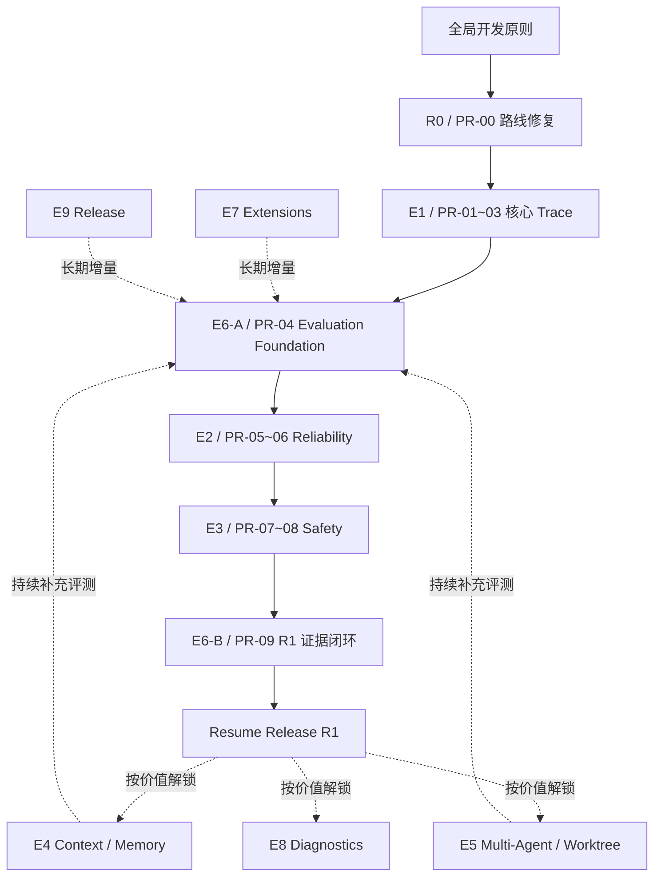

# Klaude-Code Enterprise Harness 总体开发任务书（E0–E9）

> [!important] 文档定位
> 本文档是 Klaude-Code Enterprise Harness 二次开发的**总体任务书与长期方向基线**，用于决定项目未来开发的阶段划分、优先级、依赖关系、完成标准与范围边界。
>
> 根目录 README 负责对外介绍项目；ADR 负责记录重大技术决策；Specs 负责定义技术契约；Dev Docs 负责记录具体 Task 的实现事实。若局部实现计划与本文档冲突，应先核对代码现状和新证据，再显式修订本文档，而不是静默偏离路线。

> [!note] 2026-08-24 封箱状态
> Resume Release R1、Developer Diagnostics、Context Provenance 与 Memory Governance v1 已完成实现和证据收口。项目近期进入维护暂停，当前没有活动 Stage；未来恢复入口、剩余限制和候选顺序以 [`docs/PROJECT-SNAPSHOT.md`](../../PROJECT-SNAPSHOT.md) 为准。本文仍是长期方向，不构成自动执行授权。

## 0. 项目目标与成功定义

### 0.1 项目使命

Klaude-Code 是基于开源 Easy-Agent 功能基础持续演进的独立项目。Enterprise Harness 路线不以继续堆叠 Agent 功能数量为主要目标，而是将现有本地 Coding Agent 能力逐步加固为：

- **可观测**：一次任务经历了什么能够被结构化还原；
- **可靠**：失败、重试、取消、超时和恢复具有明确语义；
- **安全**：工具、权限、路径、外部扩展和敏感信息具有可审计边界；
- **可治理**：上下文、记忆、成本和多 Agent 协作行为可以解释；
- **可评估**：关键行为能够被确定性检查，真实任务退化能够被发现；
- **可诊断**：开发者能理解失败位置、影响和恢复建议；
- **可交付**：安装、迁移、版本和发布流程具备稳定边界。

### 0.2 求职目标

本项目将作为个人日常实习与后续秋招/春招的核心工程项目，主要面向：

1. **Agent Harness 研发 / 工程方向**；
2. **Agent Evaluation / 数据与评测方向**；
3. Agent 应用开发与 Multi-Agent 方向作为已有能力背景。

项目重点对应以下岗位能力：

- Agent Loop、Tool Use、Skills、MCP、Memory、Sub-Agent、Multi-Agent；
- Trace、行为验证、过程追踪、失败恢复和安全约束；
- Benchmark 工程化、指标体系、失败分析与反馈闭环；
- 真实 Coding Workflow、长程执行和开发者体验；
- 对陌生中等规模代码库的架构审计与生产化改造能力。

### 0.3 “企业级”的现实定义

本项目追求的是**工程证据级、生产导向的个人开源项目**，而不是虚构已经达到大型企业真实生产系统的规模。

第一阶段需要做到：

- 核心路径有清晰契约和失败语义；
- 高风险边界有必要验证；
- 关键行为有 Trace 和 Evaluation 证据；
- 有真实 Coding Task、Bad Case 和修复闭环；
- 设计取舍、限制和未完成项能够诚实说明；
- 项目维护者能够脱离生成代码，解释核心调用链和设计决策。

当前不声称具备：

- 大规模真实用户或企业流量；
- 生产 Service Level Objective、值班和容量治理；
- 已经替代 Claude Code、Codex 等成熟产品；
- Stages 0–34 全部由当前维护者从零实现。

### 0.4 二次开发与贡献边界

项目对外和简历叙事采用“**成果优先、来源透明**”原则：

- Easy-Agent 提供了 Agent Loop、Tools、Session、Context、MCP、Agents、UI 等功能基础；
- Klaude-Code 的独立工作重点是架构审计、Enterprise Harness 路线设计，以及 Observability、Reliability、Safety、Evaluation、Governance 和 Diagnostics 的生产化改造；
- 不把继承能力表述为从零自研；
- 通过 Git 提交、ADR、Specs、实现报告、Evaluation 报告和 Bad Case 证明独立贡献。

推荐的项目核心叙事是：

> 针对现有本地 Coding Agent 在运行证据、失败诊断、行为回归和安全治理方面的缺口，设计并实现 Trace 驱动的 Enterprise Harness 改造，使模型、工具、权限、上下文与多 Agent 行为可观测、可恢复、可评估。

---

# 第一部分：全局开发原则

> [!warning] 这些是开发约束，不属于 E0 的功能任务
> 下列规则贯穿 E0–E9，不得将它们作为某个阶段的功能成果，也不得用流程性工作冒充 Enterprise Harness 能力建设。

## 1.1 工作区与远程边界

- 所有代码和项目工程文档都在隔离 Worktree 中修改；
- 不直接修改主仓库；
- 不清理、重置或覆盖主仓库中的用户学习笔记；
- 不向 `origin` 推送；
- 只有得到明确授权后才考虑向用户自有 `github` remote 推送；
- 删除 Worktree 前必须审计未提交、未跟踪、未合并和未发布内容；
- 当前 P0 Trace 连续任务优先继续使用既有隔离 Worktree，进入新的独立大阶段后再评估是否创建新 Worktree。

## 1.2 影响分析与变更纪律

- 修改函数、类或方法前，按项目 `CLAUDE.md` 运行 GitNexus upstream impact analysis；
- HIGH 或 CRITICAL 风险必须先报告，不得静默修改；
- GitNexus 不可用时记录原因，并采用直接调用链阅读、文本搜索和聚焦验证替代；
- 同一个问题连续尝试三次仍未解决时停止猜测，回到证据和根因分析；
- 不未经指令扩大到下一个 Task 或相邻能力域；
- 不用顺手重构、无关清理或测试扩张稀释当前 Slice。

## 1.3 高质量一次实现与风险驱动验证

项目强调：

> **先理解、先设计，争取第一遍实现正确；验证用于证明高价值承诺，而不是用大量测试弥补草率实现。**

采用以下策略：

- 不机械执行每个函数先写失败测试的 TDD；
- 不为覆盖率数字编写测试；
- 不为每个 Helper、DTO 或简单映射编写独立脚本；
- 不为每个小修改运行完整测试集；
- 不要求每次修改都运行真实模型实验；
- 类型和简单纯映射主要依赖类型系统、代码审查与必要 Build；
- 普通功能 Slice 使用最小 Smoke 或聚焦验证；
- 隐私、权限、持久化、恢复、兼容性和不可逆副作用等高风险承诺，保留少量必要回归证据；
- 阶段完成时集中验证本阶段核心承诺，不追求测试数量。

风险分级参考：

| 修改类型 | 默认验证 |
|---|---|
| 文档、类型、简单纯映射 | 人工审查；涉及 TypeScript 接口时必要 Build |
| 普通功能 Slice | Build 或一个聚焦 Smoke |
| Trace、脱敏、权限、持久化 | 最小安全/异常回归 |
| Retry、Streaming、Abort、不可逆动作 | 聚焦故障场景与行为检查 |
| 跨模块高风险修改 | 既有聚焦检查 + 一个受控真实场景 |
| 阶段版本/准备合并 | 核心聚合检查；不默认运行所有历史脚本 |

## 1.4 文档原则

- 路线、ADR、Specs、Evaluation、Dev Docs 各司其职；
- 每个主要 Task/Slice 维护一份简洁 Dev Doc，小修更新既有文档；
- Dev Doc 至少记录：问题、调用链/边界、设计决策、实际改动、必要验证、真实困难与后续限制；
- 不复制大量源码，不为简单修改写重复长文；
- 学习笔记和项目工程事实分离；
- 代码事实和提交事实优先于历史文档中的旧状态。

## 1.5 阶段完成规则

阶段完成不能只依据“Agent 已经生成代码”，而需要同时满足：

1. 核心问题已经解决；
2. 修改边界和因果链能够解释；
3. 关键异常路径没有明显遗漏；
4. 必要的最小验证通过；
5. 隐私与兼容性边界未被破坏；
6. 实现事实和剩余限制已记录；
7. 项目维护者能够复述关键设计与取舍。

---

# 第二部分：总体架构与阶段关系

## 2.1 两条项目路线

Klaude-Code 保留两条相互关联但职责不同的路线：

- **Original Foundation Track（Stages 0–34）**：提供本地 Coding Agent 的功能基础；
- **Enterprise Harness Track（E0–E9）**：对已有能力进行系统审计、可观测性接入、可靠性和安全加固、评测治理与产品化交付。

Enterprise Harness Track 不是重复实现 Stages 0–34，也不是简单为已有模块补日志。它需要把跨模块的运行行为转化为统一、可解释和可验证的系统能力。

## 2.2 领域编号与执行依赖

E0–E9 是稳定的能力域编号，不等于严格串行的实施顺序。近期工作按可独立验收的证据门推进：



## 2.3 关键修正

### Trace 不在 E1 一次性固化所有领域

E1 先完成稳定的核心因果链和可扩展 Trace Context。Context、Memory、MCP 和 Multi-Agent 的详细领域事件，在 E3–E5 真正理解并加固相应语义时接入，避免过早固化错误契约。

### Evaluation Foundation 提前，完整闭环后置

- E1 完成核心 Trace 后立即建立 E6-A：窄 Task/Trial/Grader/Result 契约、独立 Artifact Store、确定性 Core CI 和 Evidence Matrix；
- E2/E3 每个 Slice 向同一入口增加高价值不变量；
- E6-B 在 R1 收口时关闭 Claim-to-Evidence Matrix，不等待 E4/E5；
- E4/E5/E7/E8/E9 后续持续增加领域证据，E6 不是一次性终点。

Runtime Diagnostic Trace 与 Evaluation Run Record 必须分离：前者解释真实运行发生了什么并默认内容最小化；后者只在受控任务中保存 allowlisted 实验元数据和 Grader 结果。第一版只支持 Trace fixture replay 与受控 Task rerun，不声称生产 Trace 可以复现模型行为。

### Provider 一致性采用最小公共语义

E2 不承诺彻底抹平所有 Provider 差异，只统一 Harness 主路径真正依赖的最小语义：错误类别、Stop Reason、Tool Use、Usage、Abort 与 Retry。主要 Provider 做完整验证，其他 Provider 保持兼容映射并记录差异。

### Inspector 分两层

- E1：开发者使用的最小 JSONL Timeline Inspector；
- E8：产品化诊断，包括错误解释、恢复建议、配置说明和安全诊断包。

---

# 第三部分：E0–E9 详细任务

# E0：系统基线审计与目标架构

## 3.0.1 要解决的问题

> 继承的 Agent 系统已经具备什么？关键运行链路如何连接？哪些能力只是存在，哪些能力真正达到可观测、可靠、安全、可评估的状态？

E0 是技术基线与目标架构阶段，不是 Worktree、Git 纪律或文档规范的代称。

## 3.0.2 核心任务

### A. 现有能力盘点

审计并确认以下模块的实际能力和边界：

- QueryEngine 与多轮编排；
- Agentic Loop；
- Model Provider、Streaming、Retry；
- Tools、Permission、Sandbox；
- Context、Compaction、Memory、Session；
- Skills、MCP、Hooks；
- Sub-Agent、Async Agent、Agent Teams；
- Worktree、Background Execution；
- CLI、TUI、Headless/Pipe Mode。

每个能力按照以下状态分类：

- 已实现且主路径可用；
- 已实现但缺少运行证据；
- 已实现但可靠性/安全边界不足；
- 已实现但缺少 Evaluation；
- 实验性质或仍在计划中。

### B. 核心调用链与故障传播图

建立并持续校正真实运行链：

```text
User / Headless Input
  → QueryEngine
  → Agentic Loop
  → Model Provider / Stream / Retry
  → Tool Request
  → Permission Decision
  → Tool / MCP Execution
  → Context / Memory / Session
  → Sub-Agent / Multi-Agent
  → Final Result / Failure / Abort
```

不仅记录成功链路，还需要识别：

- 错误在哪里产生和转换；
- AbortSignal 如何传播；
- Retry 在哪一层决策；
- Tool 副作用何时发生；
- Context/Memory 在何时加载和写回；
- 子 Agent 如何继承约束和返回结果。

### C. Enterprise Gap Matrix

将目标岗位和生产导向能力映射到项目：

- Trace 与过程追踪；
- 行为验证和结果校验；
- 失败恢复和幂等边界；
- Tool/Permission/Sandbox 安全；
- Context Engineering 与 Memory 治理；
- Multi-Agent 协作、所有权与冲突；
- Benchmark、真实任务和反馈闭环；
- 开发者诊断与运行体验。

### D. 目标架构与阶段边界

为 E1–E9 确定：

- 真实问题；
- 核心修改边界；
- 前置依赖；
- 第一版完成标准；
- 明确非目标；
- 后续加固方向。

## 3.0.3 当前状态

**Foundation:** present  
**Klaude hardening:** in-progress

E0 已经完成部分基础工作：

- Stages 0–34 主要源码和功能路线已被系统阅读；
- P0–P4 历史总控提供了第一轮缺口分析；
- README 已形成 E0–E9 初版；
- Task 1–3 已验证 Trace 作为首个切入点的可行性。

当前仍需把能力地图、Failure Propagation Map 与 Enterprise Gap Matrix 整理成可引用证据。完成路线修复不等于 E0 整体 `evidenced`；后续 Stage 开始前继续校正对应调用链和 Gap Matrix。

## 3.0.4 第一版完成标准

- 能够解释核心 Agent 请求从输入到终止的主调用链；
- 能区分继承能力、Klaude-Code 独立改造和未来计划；
- 每个 Enterprise 阶段都有明确问题、依赖和边界；
- 不以模块数量或 README 勾选数量代替成熟度判断。

---

# E1：核心因果链 Structured Trace

## 3.1.1 要解决的问题

> 一次顶层 Query 的模型尝试、重试、工具、权限和最终终止目前无法通过统一 `traceId` 形成稳定因果链，失败后难以回答“发生了什么、在哪一层失败、是否恢复”。

E1 先建立**核心运行主链**，而不是在不了解所有领域语义前一次性固化 Context、Memory、MCP、Multi-Agent 的详细事件。

## 3.1.2 已完成基础

Task 1–3 已完成：

- `HarnessTraceEvent` v1 与共享标识符；
- 值级脱敏和安全摘要；
- JSONL Writer/Reader；
- 受控存储路径和 Trace ID 消毒；
- Writer 失败隔离；
- `query.started`、`query.finished`、`query.failed`、`query.aborted`；
- Query 生命周期安全 payload。

## 3.1.3 剩余核心任务

### A. Trace Context 传播

建立可选、低侵入的 Trace Context，使：

```text
QueryEngine
  → Agentic Loop
  → Model Attempt
  → Tool / Permission
```

共享同一个顶层 `traceId`，并通过 `spanId`、`turnId`、`toolUseId` 表达局部因果关系。

要求：

- 未传 Trace Context 的旧调用方行为保持兼容；
- Trace 不改变 Prompt、模型请求、Tool Result 和 Permission 结果；
- Trace 写入失败不能改变主路径。

### B. Model Attempt / Retry / Stream Events

记录：

- `model.requested`；
- `model.completed`；
- `model.failed`；
- `retry.scheduled`；
- `stream.restarted`。

仅记录安全元数据：

- provider/model；
- turn/attempt；
- message/tool 数量；
- Stop Reason；
- Usage；
- Duration；
- Error Category；
- Retryability、Delay 与 Budget。

禁止记录：Prompt、完整 Messages、模型原始文本、Provider Response Body、Token/Key。

### C. Tool / Permission 核心事件

先覆盖核心统一执行边界：

- `tool.started`；
- `tool.completed`；
- `tool.failed`；
- `permission.requested`；
- `permission.resolved`。

记录：Tool Name、Input/Result Summary、Outcome、Decision、Decision Source、Duration，不记录命令、文件正文、stdout/stderr 或完整参数。

详细 Permission 状态模型、Sandbox 与 MCP 安全语义在 E3 加固时完善，并同步扩展对应领域事件。

### D. 最小 Trace Inspector

提供面向开发者的最小读取入口，将 JSONL 按 `sequence` 输出为简洁时间线：

```text
query.started
model.requested attempt=1
retry.scheduled
model.requested attempt=2
tool.started Read
permission.resolved allow
tool.completed success
model.completed end_turn
query.finished completed
```

非目标：Dashboard、复杂筛选、恢复建议、共享诊断包。这些属于 E8。

## 3.1.4 后续领域事件接入原则

- Context/Compaction/Memory 事件：随 E4 语义治理接入；
- MCP 外部执行事件：随 E3 安全边界接入；
- Sub-Agent Parent/Child Trace：随 E5 编排治理接入；
- Skills/Extensions 生命周期：随 E7 扩展治理接入。

E1 必须保证事件契约可扩展，但不提前猜测这些领域的完整语义。

## 3.1.5 第一版完成标准

一条包含模型重试和工具调用的顶层任务能够还原：

```text
Query
  → Model Attempt
  → Retry / Stream Restart（若发生）
  → Tool Request
  → Permission Decision
  → Tool Result
  → Model Completion / Failure
  → Query Termination
```

并满足：

- 同一 Query 共享 `traceId`；
- sequence 单调；
- Span/Turn/Tool 关系可解释；
- 不泄漏高风险正文；
- Writer 失败不影响主路径；
- 最小 Inspector 可读。

## 3.1.6 明确非目标

- 不在 E1 建成全领域 Trace；
- 不建立云端 Observability；
- 不保存完整 Prompt/Tool 内容；
- 不在此阶段建设完整 Evaluation Framework；
- 不为了事件数量修改所有运行模块。

---

# E2：运行时可靠性与恢复

## 3.2.1 要解决的问题

> 模型错误、网络抖动、Streaming 中断、Context Overflow、Abort 和 Timeout 已存在分散处理，但缺少统一、可预测和可解释的恢复语义。

E2 是 Agent 主动力系统的可靠性升级，所有恢复过程必须能通过 E1 Trace 解释。

## 3.2.2 核心任务

### A. 统一错误分类

建立 Harness 级安全分类：

- transient network；
- rate limit；
- timeout；
- authentication/configuration；
- malformed/provider response；
- context overflow；
- tool error；
- permission denial；
- user abort；
- unknown。

Provider 原始错误映射到公共分类，同时保留必要且安全的 Provider-specific code，不能直接持久化原始 Response Body。

### B. Retry Policy

明确：

- 哪些错误可重试；
- 哪些错误立即失败；
- attempt 编号；
-最大 attempts；
- Backoff；
- `Retry-After`；
- Retry Budget；
- 最终失败原因。

重试策略必须避免：

- Authentication 等永久错误盲目重试；
- Usage 重复累计；
- 已发生不可逆 Tool 副作用后静默重复执行。

### C. Streaming Recovery

区分并处理：

- 建流前失败；
- Streaming 中断；
- 已产生部分输出；
- Stream Restart；
- 重复文本风险；
- 重复 Tool Use 风险；
- Context Compaction 后重启；
- 最终不可恢复失败。

### D. Abort、Timeout 与资源释放

统一：

- 模型等待期间 Abort；
- Tool 执行期间 Abort；
- MCP Timeout；
- Sub-Agent/Background Task Timeout；
- 子进程回收；
- Trace Writer Close；
- 取消后禁止启动新的业务步骤。

MCP 和 Sub-Agent 的具体语义分别在 E3、E5 深化，E2 先定义公共取消/超时原则。

### E. Context Overflow Recovery

梳理并加固：

- Token Warning；
- Reactive Compaction；
- Stream Restart；
- Blocking Limit；
- Recovery 成功；
- Compaction 失败；
- 最终终止。

详细 Context 保真和预算治理在 E4 完成。

### F. Provider 最小公共语义

只统一 Harness 主路径依赖的：

- Stop Reason；
- Tool Use；
- Usage；
- Error Category；
- Abort；
- Retryability。

第一版选择当前主要 Provider 做完整验证；其他 Provider 保持兼容映射、记录差异，不承诺完全消除所有 Provider-specific 行为。

## 3.2.3 第一版完成标准

- 可恢复错误按明确预算重试；
- 永久错误不会盲目重试；
- Streaming 中断的部分输出和重复副作用风险有明确处理；
- Abort 后不启动新业务动作；
- Timeout 能释放可控资源；
- Context Overflow 有可预测恢复路径；
- Provider 差异不会静默破坏 Tool Use、Usage 和终止判断；
- Retry/Restart/Failure 可以通过 Trace 解释。

## 3.2.4 必要验证边界

E2 不建设完整 Evaluation，但至少需要集中确认高风险承诺：

- 一条可恢复 Retry 路径；
- 一条不可恢复失败路径；
- 一条 Abort/Timeout 路径；
- 不可逆 Tool 不因模型 Retry 被静默重复执行。

不为每个 Error Code 编写独立脚本。

---

# E3：Tool、Permission、Sandbox 与外部执行安全

## 3.3.1 要解决的问题

> Agent 可以访问文件、Shell、网络和 MCP 后，如何防止越权、路径逃逸、权限绕过、秘密泄漏和不可逆副作用？

## 3.3.2 核心任务

### A. Tool 输入与输出契约

统一：

- Schema 与必填字段；
- 类型和枚举校验；
- 路径规范化；
- 输入/输出大小上限；
- Timeout；
- 错误分类；
- 安全 Result Summary。

### B. Permission 状态模型

统一不同入口中的：

- allow；
- deny；
- ask；
- block；
- bypass；
- rule；
- mode；
- classifier；
- user；
- headless。

要求相同动作不会因入口不同产生无法解释的矛盾语义。

### C. 高风险动作治理

覆盖：

- 删除与覆盖；
- Git Push；
- 外部发布；
- 权限提升；
- 不受控路径；
- 网络副作用；
- 环境变量与密钥；
- 不可逆动作重试；
- 主机系统状态修改。

### D. Sandbox 边界

加固：

- cwd；
- 路径穿越；
- Shell 包装；
- 子进程；
- Timeout；
- 输出上限；
- 进程回收；
- 平台差异的安全降级。

### E. MCP 安全边界

确认：

- MCP Tool 不能绕过 Permission；
- 外部 Tool 遵守同等的输入、Timeout 和输出边界；
- Server 超时/异常不破坏主 Loop；
- Server 和 Tool 来源可识别；
- 返回正文不会被不受控写入 Trace/Log；
- 信任边界清晰。

同步补充 E1 的 MCP 领域 Trace：连接、调用、超时、失败和来源摘要。

### F. Secret Safety

防止 Secret 出现在：

- Trace；
- Debug Log；
- Error；
- Tool/MCP Output Summary；
- Environment Summary；
- Diagnostic Bundle。

## 3.3.3 第一版完成标准

- Permission deny/block 后 Tool 不实际执行；
- 路径穿越被阻止；
- 高风险外部动作需要符合明确审批规则；
- MCP 不能绕过本地权限体系；
- Tool/MCP Timeout 能终止或安全降级；
- Secret 不进入 Trace 和诊断数据；
- 不可逆 Tool 不会因自动恢复被静默重复执行；
- Tool/Permission/MCP 关键决策有安全 Trace。

## 3.3.4 必要验证边界

只保留高价值安全场景，例如：

- Permission Deny 后未执行；
- 路径穿越被阻止；
- MCP/Tool Timeout 不拖死主 Loop；
- 假 Secret 不出现在 Trace/Diagnostic。

不追求枚举所有 Tool 的重复测试。

---

# E4：Context、Memory 与成本治理

## 3.4.1 要解决的问题

> 长程 Coding Task 中，Agent 为什么加载某些信息？Compaction 是否丢失关键约束？Memory 是否过期、冲突或污染？Token 和成本是否失控？

## 3.4.2 核心任务

### A. Context Provenance

为以下来源建立可解释元数据：

- System Prompt；
- Project Instructions；
- User/Project Memory；
- Session History；
- Tool Result；
- Attachment；
- Plan；
- Skill；
- MCP Resource。

记录来源类别、资格与规模，不复制高风险正文。

### B. Context Budget

统一治理：

- System Prompt；
- Messages；
- Tool Output；
- 文件内容；
- 图片；
- Memory；
- Attachments；
- Compaction Threshold。

### C. Compaction 正确性

压缩后优先保留：

- 用户硬约束；
- 已做出的设计决策；
- 修改范围；
- 禁止操作；
- 未完成任务；
- 错误、验证结果和下一步。

明确手动/自动 Compaction、失败和恢复语义。

### D. Memory 生命周期

治理：

- 来源；
- 时效；
- 相关性；
- 冲突；
- 更新；
- 删除；
- 污染；
- User/Project Memory 边界。

### E. Usage 与成本

汇总：

- Input；
- Output；
- Cache；
- 每个 Model Attempt；
- 每个 Query；
- Sub-Agent；
- Compaction 前后；
- 任务总成本。

### F. Context/Memory 领域 Trace

在本阶段明确语义后接入：

- Context sources selected/omitted；
- Context budget summary；
- Compaction trigger/result；
- Memory loaded/ignored/written；
- Overflow/recovery；
- Usage/cost summary。

只记录结构和安全摘要。

## 3.4.3 第一版完成标准

- 能说明主要 Context 来源为何被加载；
- Context 各组成部分有明确预算；
- Compaction 不应静默丢失关键硬约束；
- Memory 冲突、过期和来源可识别；
- 每个任务能输出 Usage/Cost 摘要；
- Context Overflow 有可预测恢复路径；
- Context/Memory 关键行为有结构化证据。

## 3.4.4 必要验证边界

聚焦证明：

- 一次 Compaction 后关键约束仍存在；
- 一次过期/冲突 Memory 被识别；
- Usage/Cost 不因 Retry/Restart 重复统计。

不建设大规模 Context Benchmark，统一评测留到 E6。

---

# E5：Multi-Agent 与 Worktree 编排

## 3.5.1 要解决的问题

> Sub-Agent、Background Agent、Agent Teams 和 Worktree 已经能并发执行，但任务所有权、基线、冲突、失败恢复和合并责任仍缺少统一治理。

## 3.5.2 核心任务

### A. 任务分解与依赖

每个任务明确：

- Goal；
- Inputs；
- Expected Outputs；
- Owner；
- `blockedBy` / `blocks`；
- Completion Criteria；
- Handoff Format。

### B. 文件 Ownership 与冲突预检

- Agent 启动前声明预计修改范围；
- 检查文件/符号重叠；
- 冲突任务改为串行或重新拆分；
- 不等到 Merge 时才发现明显冲突。

### C. Worktree Baseline

明确：

- `fresh`；
- `head`；
- specific commit；
- Snapshot 时点；
- 父会话后续改动不会自动进入子 Worktree。

### D. Parent/Child Context 与 Trace

传递：

- 任务与约束；
- 已知事实；
- 文件范围；
- 禁止操作；
- 输出格式；
- Trace Context。

建立：

- `parentTraceId`；
- `childTraceId`；
- Agent spawned/finished/failed；
- isolation/execution mode；
- duration/usage summary。

子 Agent 不伪装成父 Agent 的普通 Tool Event。

### E. Timeout 与部分完成恢复

Agent 超时或失败时保留：

- 当前状态；
- 已修改文件；
- 已完成步骤；
- 验证结果；
- 未完成事项；
- 可继续使用的产物；
- 阻塞原因。

### F. 合并与最终责任

- Worker 只证明自己的工作；
- 主会话负责整合后的最终判断；
- 合并前检查影响范围和语义冲突；
- 删除 Worktree 前完成状态审计；
- 合并后必要时进行一个聚焦主路径检查。

## 3.5.3 第一版完成标准

- 多 Agent 任务有明确所有者和依赖；
- 文件冲突可在执行前发现；
- Worktree 基线可解释；
- Parent/Child Trace 可关联；
- 子 Agent 超时或部分失败不会丢失全部上下文；
- 合并结果由主会话承担最终责任；
- Worktree 不会未经审计被删除。

## 3.5.4 必要验证边界

用一个受控并行任务证明：

- 所有权声明；
- 非冲突并行；
- Parent/Child Trace；
- 一个失败/超时后的交接；
- 主会话整合。

不为追求并发数量启动大规模 Agent Fleet。

---

# E6：Evaluation、Benchmark 与质量门禁

## 3.6.1 阶段定位

E6 不是第一次测试代码，也不是所有 Evaluation 的终点。它分阶段交付：

- **E6-A / PR-04**：在 E1 核心 Trace 后建立 Task/Trial/Grader/Result、独立 Artifact Store、Evidence Matrix 和确定性 Core CI；
- **E6-B / PR-09**：消费 E2/E3 的证据关闭 Resume Release R1；
- **E6-C / PR-16**：R1 后再做受控外部 Benchmark、真实模型 Trial 和必要 CI 扩展；
- E4/E5/E7/E8/E9 的新能力持续向同一体系补充检查。

## 3.6.2 核心任务

### A. Deterministic Harness Evaluation

E6-A 使用 Fake Provider、Fake Tool 或合成 Fixture，先覆盖 R1 已承诺的不变量：

- Trace Schema 与 Sequence；
- Query/Model/Retry Lifecycle；
- Streaming Recovery；
- Tool/Permission/Sandbox；
- Sandbox/MCP 与 Secret Safety 随 PR-08 增补；
- Writer Failure Isolation；
- Privacy。

原则：由 Claim/Invariant-to-Evidence Matrix 决定证据，不预设每个领域的测试数量，也不追求覆盖率数字。

### B. 受控外部 Coding Task Benchmark（E6-C）

证据来源：

- 用户自己的多个真实仓库；
- 少量可安全复制、可受控修改的公开开源仓库；
- 不直接污染重要仓库；
- 每个任务使用固定基线和明确验收条件。

任务类型可包括：

- 文件定位与解释；
- 小型 Bug Fix；
- 小功能实现；
- 测试/构建错误修复；
- 权限拒绝后的改道；
- 模型重试与恢复；
- 长程 Context/Compaction；
- Multi-Agent 分工。

不预设仓库数和任务数。样本规模由已声明的不变量、成本和可复现性决定；每次 Trial 单独报告，不从小样本推断成功率分布。

### C. 指标体系

过程指标：

- Task Completion；
- Tool Success/Error；
- Permission Correctness；
- Retry Recovery；
- Context Recovery；
- Human Intervention；
- Duration；
- Input/Output/Cache Usage；
- Cost；
- Safety Violation；
- Failure Category。

结果质量不只看最终文本，也结合：

- 是否修改正确文件；
- 是否遵守用户约束；
- 是否执行必要验证；
- 是否引入无关改动；
- 是否产生危险副作用。

### D. Evaluation 报告

同时输出：

- 机器可读 JSON；
- 人类可读 Markdown Summary；
- 失败分类；
- 对应 Trace/Fixture；
- Bad Case；
- 修复建议；
- 修复前后对比；
- 样本规模和已知限制。

### E. Bad Case → Fix → Regression

至少形成完整案例：

```text
真实 Coding Task
  → Trace 发现失败阶段
  → 根因分析
  → 最小修复
  → 加入确定性回归
  → 重新运行真实任务
  → 报告修复前后变化
```

### F. GitHub Actions 最小质量门禁

每次 Push 或 Pull Request 在干净环境自动执行：

- 安装依赖；
- TypeScript Build；
- 核心 Deterministic Harness Evaluation。

首版不做：

- 覆盖率门槛；
- 所有历史脚本；
- 多操作系统矩阵；
- 真实 DeepSeek API；
- 大规模 Benchmark；
- 自动发布。

GitHub Actions 的意义是证明关键约束可以在干净环境重复验证，不是增加测试数量。

### G. 真实模型 API 实验（E6-C）

真实模型实验不等于模型训练。它用于在受控 Coding Tasks 中观察真实行为：

- 固定仓库基线；
- 固定任务和验收条件；
- 使用 Klaude-Code 调用当前明确授权的模型 Profile；
- 收集 Trace；
- 判断是否完成；
- 汇总失败、恢复、耗时、Token 和成本；
- 对非确定性结果如实报告。

真实 API 不进入 CI；CI 使用 Deterministic Fixture 保证稳定。

## 3.6.3 分阶段完成标准

**E6-A / PR-04：**

- Task/Trial/Grader/Result 和 Artifact Storage Policy 有窄契约；
- R1 每个已声明不变量都有确定性断言或被移出 R1；
- 本地与 CI 使用同一 Core 命令，不访问真实网络或付费模型；
- JSON/Markdown 报告能定位失败 Stage，产物满足 allowlist、脱敏与 Retention。

**E6-B / PR-09：**

- Claim-to-Evidence Matrix 关闭；
- 至少一条受控端到端任务与一个 Bad Case 修复闭环；
- 报告包含失败解释和现实限制；
- 不以测试数量、覆盖率或未经验证的成功率充当成果。

多仓库 Benchmark、真实模型 Trial 和统计探索属于 E6-C，不阻塞 R1。

## 3.6.4 持续演进规则

E6 完成后不是冻结：

- E7 新增 Extension Lifecycle Evaluation；
- E8 新增 Diagnostic Correctness 与安全分享检查；
- E9 新增安装、迁移、升级和跨平台验证；
- 每个真实 Bad Case 继续转化为最小回归。

---

# E7：Skills、MCP 与扩展生态治理

## 3.7.1 要解决的问题

> Skills、Hooks、MCP、Agent Definitions 和未来 Plugins 已形成多个扩展入口，但缺少统一的来源、能力、兼容性、生命周期和故障隔离模型。

E3 已处理 Tool/MCP 的运行时安全；E7 处理更高层的扩展治理与生态准备，不重复 E3。

## 3.7.2 核心任务

- 统一扩展元数据；
- Capability 声明；
- 来源和 Provenance；
- 版本/协议兼容检查；
- 发现、加载、启用、禁用、更新；
- Timeout 和 Failure Isolation；
- Permission 集成；
- 本地扩展注册表；
- 诊断与恢复；
- Plugin 契约；
- Marketplace 前置安全要求。

同步完善 Extension/Skill 生命周期 Trace，并向 E6 增加代表性评测。

## 3.7.3 第一版完成标准

- 扩展来源可识别；
- 不兼容版本产生清晰错误；
- 损坏扩展不导致主 CLI 崩溃；
- 扩展能力受 Permission 管理；
- 扩展可禁用、诊断和恢复；
- 未受信任扩展不能静默获得高风险能力；
- Extension Lifecycle 有必要的 Trace 和 Evaluation。

## 3.7.4 明确非目标

- 不立即建设公开 Marketplace；
- 不在安全、兼容性和发布门禁完成前开放任意第三方分发；
- 不同时重写 Skills、Hooks、MCP 和 Plugins 的全部实现。

---

# E8：开发者体验与运行诊断

## 3.8.1 要解决的问题

> 系统内部已经产生 Trace、Recovery 和 Evaluation 证据，但普通开发者仍可能需要直接读 JSONL 或源码才能理解失败。

E8 将内部证据产品化为可理解、可恢复的开发者体验。

## 3.8.2 核心任务

- 产品化 Trace Timeline；
- Trace Inspector 查询与摘要；
- `/doctor` 或等价诊断入口；
- 有效配置来源和优先级说明；
- Retry/Stream Restart 解释；
- Permission Decision 解释；
- Context/Compaction/Memory 解释；
- Usage/Cost 展示；
- Session Resume 和失败恢复指导；
- 安全诊断包；
- Evaluation 摘要；
- Bad Case 定位入口。

安全诊断包不得默认包含 Prompt、文件正文、Tool 完整输入输出、密钥和绝对敏感路径。

## 3.8.3 第一版完成标准

用户不阅读源码、不直接解析 JSONL，也能回答：

- 任务为什么失败；
- 失败发生在哪一阶段；
- 是否发生模型重试；
- 是否调用/执行过工具；
- Permission 如何决策；
- 是否发生 Compaction 或 Memory 加载；
- 是否启动子 Agent；
- 是否可能恢复；
- 下一步建议是什么。

## 3.8.4 与 E1 的边界

- E1 Inspector：开发者最小时间线，只证明 Trace 可消费；
- E8 Diagnostics：面向用户的解释、查询、恢复建议和安全分享能力。

E8 的诊断正确性和隐私边界必须加入 E6 持续评测。

---

# E9：Packaging、Compatibility 与 Release

## 3.9.1 要解决的问题

> 运行时身份、配置、数据目录、跨平台、版本和发布流程仍保留继承兼容性，如何在不破坏用户数据的前提下完成产品化交付？

## 3.9.2 核心任务

- Package identity 从 `easy-agent` 向 `klaude-code` 的兼容迁移；
- CLI `agent` 命令保留别名或分阶段迁移；
- Settings、Session、Memory、Trace 数据目录迁移；
- Windows、macOS、Linux 安装与运行验证；
- npm Preview / Release Candidate；
- 版本、Changelog、Release Notes；
- Upgrade、Rollback 与 Migration；
- 安装、配置、排障和维护文档；
- 贡献策略与安全报告入口；
- 发布前 Build、Evaluation、安全和兼容性门禁。

## 3.9.3 第一版完成标准

- 新旧身份和 CLI 迁移路径明确；
- 用户配置和历史数据不被静默丢失；
- 至少主要目标平台安装/启动可验证；
- 版本和发布产物可复现；
- 升级失败有回滚路径；
- 发布说明诚实标注兼容性和未完成项；
- 安装、迁移和发布检查接入 E6 持续评测体系。

## 3.9.4 明确非目标

- 不在前置安全、评测和兼容性能力未成熟时追求大规模分发；
- 不通过一次破坏性重命名完成身份迁移；
- 不把 README 重定位误报为运行时迁移完成。

---

# 第四部分：优先级与阶段交付策略

## 4.1 第一版核心闭环

第一版最重要的求职成果不是 E0–E9 全部勾选，而是形成以下可深入答辩的闭环：

### 闭环 A：Trace 与运行证据

```text
统一事件契约
  → Query/Model/Retry/Tool/Permission 因果链
  → 隐私最小化
  → JSONL 存储
  → Inspector
```

### 闭环 B：可靠性与安全

```text
错误分类
  → Retry/Streaming/Abort/Timeout
  → Tool/Permission/Sandbox/MCP 边界
  → 不可逆副作用保护
  → Trace 解释
```

### 闭环 C：Evaluation 与反馈

```text
Deterministic Evaluation Foundation
  → Reliability / Safety 不变量
  → Claim-to-Evidence Matrix
  → 受控端到端 Task
  → Bad Case
  → Fix
  → Regression
  → Resume Release R1
```

Context/Memory 与 Multi-Agent 是重要方向，但第一版必须避免它们拖垮以上三条核心闭环的交付证据。

## 4.2 优先级保护

### 必须完成

- E1 核心因果链 Trace；
- E2 可靠性与恢复第一版；
- E3 Tool/Permission/Sandbox/MCP 安全第一版；
- E6 Evaluation、真实任务、Bad Case 和最小 CI 闭环。

### 尽量完成

- E4 Context/Memory/Cost 第一版；
- E5 Multi-Agent/Worktree 编排第一版。

### 后续长期推进

- E7 扩展生态治理；
- E8 产品化诊断；
- E9 Packaging/Compatibility/Release。

> [!important] 优先级解释
> “尽量完成”不代表只做演示，而是指在固定投递窗口内，若 E4/E5 暴露超出预期的架构复杂度，应保留完整设计、完成最高价值主路径，并优先保证 E1/E2/E3/E6 形成可展示、可验证、可答辩的完整闭环。

---

# 第五部分：证据门执行节奏

> [!note] 历史基线
> 原“2026 年 8 月四周计划”已经失效，仅作为规划历史保留在 Git 中，不再作为完成承诺。当前不使用未经证据支持的自然周日期。

## 5.1 Resume Release R1

| 顺序 | PR Stage | 核心结果 |
|---|---|---|
| 1 | PR-00 / R0 | 路线、编号、状态、入口一致 |
| 2 | PR-01 / R1-A | Trace Storage & Availability Contract |
| 3 | PR-02 / R1-B | Model / Retry / Stream Trace |
| 4 | PR-03 / R1-C | Tool / Permission Trace & Inspector |
| 5 | PR-04 / R1-D | E6-A Evaluation Foundation |
| 6 | PR-05 / R1-E | Error Taxonomy / Retry / Provider |
| 7 | PR-06 / R1-F | Streaming / Abort / Context Recovery |
| 8 | PR-07 / R1-G | Tool / Permission Safety Contract |
| 9 | PR-08 / R1-H | Sandbox / MCP / Secret Safety |
| 10 | PR-09 / R1-I | Evidence Closure & Resume Release |

详细范围、停止条件和 R2/R3 候选见 [阶段性开发与 PR 安排](../plans/2026-08-24-enterprise-harness-staged-pr-plan.md)。

## 5.2 调整规则

- 一个 PR 只执行一个已授权 Stage，合并后再为下一 Stage 编写 JIT 计划；
- 不因局部低价值边界延期整个主闭环，也不把未经理解的生成代码标记为完成；
- PR-06 若无法独立审查，在写代码前重新提议拆分并获得授权；
- E4/E5/E8 在 R1 后按 Bad Case 和求职价值解锁；E7/E9 保持长期路线；
- 所有计划以代码现状和新证据为准，必要时显式修订本文档。

---

# 第六部分：各阶段证据产物

| 阶段 | 核心工程产物 | 求职/答辩证据 |
|---|---|---|
| E0 | 架构调用链、Gap Matrix、目标架构 | 能审计陌生系统并制定生产化路线 |
| E1 | Trace Contract、Context、JSONL、Inspector | 能设计低侵入、隐私安全的可观测体系 |
| E2 | Error Taxonomy、Retry/Streaming/Abort Recovery | 能处理模型 API 与长程运行失败 |
| E3 | Permission/Sandbox/MCP/Secret Safety | 能治理 Agent 工具副作用与信任边界 |
| E4 | Context Provenance、Compaction、Memory、Cost | 能解释 Context Engineering 与长期任务退化 |
| E5 | Ownership、Worktree、Parent/Child Trace、Handoff | 能设计可恢复的 Multi-Agent 工程编排 |
| E6 | Evaluation、Benchmark、报告、Bad Case、CI | 能以数据和回归驱动 Agent 迭代 |
| E7 | Extension Contract、Capability、Compatibility | 能治理扩展生态生命周期 |
| E8 | Diagnostics、Doctor、Timeline、Recovery Guidance | 能将底层证据转化为开发者体验 |
| E9 | Packaging、Migration、Release | 能完成兼容、安全、可回滚的产品交付 |

---

# 第七部分：状态管理与路线修订

## 7.1 双维状态

- **Foundation:** `absent | inherited | present`
- **Klaude hardening:** `not-started | in-progress | evidenced | deferred`

`Foundation` 描述基础能力是否存在及其来源；`Klaude hardening` 描述 Klaude-Code 独立加固的证据状态。

## 7.2 状态判断规则

- 一个模块“存在”或来自 inherited foundation，不等于 Klaude hardening 完成；
- 一个脚本通过不等于系统可靠；
- README 写了计划不等于功能实现；
- 单次真实模型成功不等于 Benchmark 通过；
- 没有记录限制和失败边界的成果不能标为 `evidenced`；
- `evidenced` 必须限定到具体 Slice，不能用局部完成代表整个 E 阶段永久完成。

## 7.3 修订触发条件

出现以下情况时应修订本文档：

- 代码现状证明阶段依赖错误；
- 新 Trace/Bad Case 暴露更高优先级问题；
- 某阶段与相邻阶段职责重复；
- 真实 Benchmark 表明当前目标没有价值；
- 投递窗口或资源约束发生实质变化；
- 新岗位需求带来明确且可验证的能力缺口。

修订时应保留：

- 原计划；
- 新证据；
- 调整原因；
- 对已完成和未完成工作的影响。

---

# 第八部分：最终原则

Klaude-Code Enterprise Harness 路线遵循以下长期判断：

1. **先理解现有系统，再改造关键缺口。**
2. **先建立核心运行证据，再加固恢复和安全。**
3. **领域语义在被真正理解时接入 Trace，不提前猜测并固化。**
4. **每个阶段进行必要验证，但正式 Evaluation 在主要运行域第一轮加固后统一建设。**
5. **Evaluation 建成后持续扩展，不把它当成一次性终点。**
6. **以少量高价值闭环替代大量浅层功能。**
7. **以一次高质量实现和风险驱动验证替代机械 TDD 与覆盖率崇拜。**
8. **以真实任务、Trace、Bad Case、修复和回归构成工程证据。**
9. **以透明的二次开发边界展示架构审计和生产化改造能力。**
10. **可以积极推进、快速实现，但不能以生成速度替代理解、证据和完成质量。**

> [!success] 第一版最终目标
> 在 2026 年 9 月初形成一个能够真实展示以下能力的 Klaude-Code 版本：
>
> - 一次 Coding Task 的核心运行因果链可观测；
> - 模型失败、重试、流恢复、取消和超时可解释；
> - Tool、Permission、Sandbox 与 MCP 具有明确安全边界；
> - Context、Memory 和 Multi-Agent 被明确列为 R1 后增强，不阻塞核心闭环；
> - Deterministic Evaluation 与一条受控端到端 Coding Task 形成反馈闭环；
> - 至少一个 Bad Case 被定位、修复并固化为回归；
> - GitHub Actions 能在干净环境运行最小质量门禁；
> - 项目维护者能够清楚说明继承基础、独立贡献、设计权衡、指标结果和现实限制。
